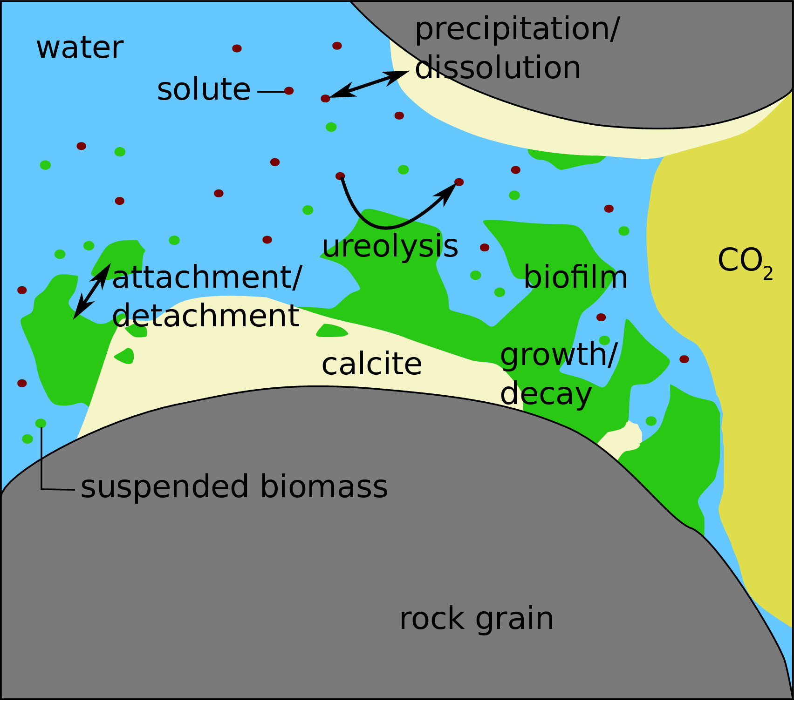
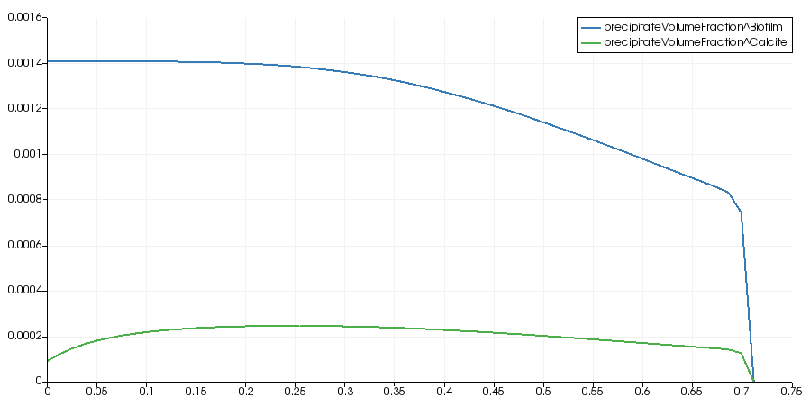

# Biomineralization

Microbially induced calcite precipitation (MICP) is a biomeineralization technology.
It can be used in the context of sealing possible leakage pathways of subsurface gas or oil reservoirs as well as other applications.
The necessary processes are two-phase multi-component reactive transport including precipitation and dissolution
of calcite as well as the biomass-related processes: attachment of biomass to surfaces,
detachment of biomass from a biofilm, and growth and decay of biomass.
Additionally, the reduction in porosity and permeability has to be considered;
this results from the presence of the solid phases biofilm and calcite in the pore space.

MICP offers an engineering option that
uses controlled biofilm growth to achieve targeted
calcite precipitation. In subsurface applications, this process is typically
associated with a reduction of porosity and, even more importantly, of permeability.
As an engineering technology, it can be used to alter hydraulic flow conditions
and can be applied, for example, to cut off highly permeable pathways such as
fractures, faults, or behind-casing defects in boreholes within a geological
formation, e.g. [@Phillips2013a].

The bacterium used, $`\textit{S.~pasteurii}`$,
expresses the enzyme urease that catalyzes the hydrolysis reaction of
urea (CO(NH<sub>2</sub>)<sub>2</sub>) into ammonia (NH<sub>3</sub>) and carbon
dioxide (CO<sub>2</sub>):

```math
\mathrm{CO(NH_2)_2} + 2\mathrm{H_2O} \xrightarrow{urease}
2\mathrm{NH_{3}} + \mathrm{H_2CO_{3}}.
```

Aqueous solutions of ammonia become alkaline until the equilibrium of ammonium and ammonia is reached.
Thus, the ureolysis reaction leads to an increase in pH until the pH is equal to the pKa of ammonia:
This shifts the
carbonate balance in an aqueous solution toward higher concentrations of
dissolved carbonate.
Adding calcium to the system then results in the precipitation of calcium carbonate:

```math
\mathrm{CO_{3}^{2-}} + \mathrm{Ca^{2+}} \longrightarrow \mathrm{CaCO_3 \downarrow}.
```

The resulting overall MICP reaction equation is:

```math
\mathrm{CO(NH_2)_2} + 2\mathrm{H_2O} + \mathrm{Ca^{2+}} \xrightarrow{urease}
2\mathrm{NH_{4}^{+}} + \mathrm{CaCO_{3}} \downarrow.
```

In a porous medium, this process,
which results in the aforementioned impacts on the hydraulic properties,
depends on the interplay between biofilm growth, fluid dynamics,
and reaction rates.
A pore-scale sketch of the most important processes of MICP is shown
in the Figure.





A major difficulty for practical engineering applications of MICP is the predictive planning of its use and impact, since it involves a number of complex interacting processes.
While the basic chemistry and the flow processes are known, it is the exact quantitative description of the interactions and, in particular, the influence of the biofilm and the developing precipitates that pose challenges to achieving predictability.


However, for the sake of simplicity, the dissociation processes are not modeled in this example and it
is assumed that the system has reached a steady state were the calcite precipitation rate is equal to the rate of ureolysis.

# Model Concept
The conceptual model for biomineralization follows the one presented by [@Ebigbo2012] and [@Hommel2015].
It accounts for two-phase multi-component reactive transport on the continuum scale, including biofilm and calcite as solid phases.
The reactions considered are pH-dependent dissociation reactions, microbial growth, and decay as well as microbially catalyzed ureolysis and mass-transfer reactions between the different phases.
A mass transfer may occur between both fluid phases by the mutual dissolution of water and CO<sub>2</sub> in the gas or the aqueous phase. It may also occur between
the aqueous phase and the two *solid* phases, biofilm and calcite denoted by subscripts (f) and (c) respectively, by attachment or
detachment of biomass and precipitation or dissolution of calcite.

The mobile components, denoted by superscripts k, are water (w), dissolved inorganic carbon (C<sub>tot</sub>),
sodium (Na), chloride (Cl), calcium (Ca), urea (u), substrate (s), oxygen (O<sub>2</sub>), and suspended biomass (b).
A substrate is the carbon and energy source of the bacteria and O<sub>2</sub> is the electron acceptor.


The primary variables solved are the aqueous-phase pressure $`p_\mathrm{w}`$, mole fractions $` \textbf v `$ $`x^\kappa_\mathrm{w}`$ of component k in the water phase, and
for the solid phases biofilm and calcite, volume fractions $`\phi_\lambda `$ .
However, the CO<sub>2</sub>-phase saturation is used as the primary variable instead of the mole fraction of total inorganic carbon in water $`x^\mathrm{C_{tot}}_\mathrm{w}`$
whenever both fluid phases are present within the same control volume ([@Class2002]).
All reactive and mass-transfer processes are incorporated in the mass balance equations for the components by component-specific source and sink terms:

```math
\sum\limits_{\alpha} \left[\frac{\partial}{\partial t}\left(\phi \rho_\mathrm{\alpha,\,mol} x^\kappa_\alpha S_\alpha \right) + \nabla\cdotp \left(\rho_\mathrm{\alpha,\,mol} x^\kappa_\alpha \mathbf{v}_\alpha \right) - \nabla\cdotp \left(\rho_\mathrm{\alpha,\,mol} \mathbf{D}^\kappa_\mathrm{pm,\alpha} \nabla x^\kappa_\alpha \right) \right] = q^\kappa,\:\alpha\in \mathrm{\{n;w\}} .
\tag{1}
```

Here, $`t`$ is time, $`\phi`$ porosity, $`\rho_\mathrm{\alpha,\,mol}`$, $`S_\alpha`$,
and $`\mathbf{v}_\alpha`$ the molar density, saturation and the velocity of phase $`\alpha`$ respectively,
$`x^\kappa_\alpha`$ the mole fraction of component k in phase $`\alpha `$ .
$`\mathbf{D}_\mathrm{pm,\alpha}`$ is the dispersion tensor of phase $`\alpha`$ in the porous medium,and $`q^\kappa`$ is the source term of component k due to biochemical reactions. However, all components except water, CO<sub>2</sub> , and O<sub>2</sub> are assumed to be restricted to the water phase.

The mass balances for the solid phases calcite and biofilm contain
only a storage and source term since they are immobile:

```math
\frac{\partial}{\partial t} \left(\phi_\lambda \rho_\lambda \right) = q^\lambda,\:\lambda\in \mathrm{\{c;f\}}.
\tag{2}
```

Here, $`\phi_\lambda`$ and $`\rho_\lambda`$ are volume fraction and mass density of
the solid phase $`\lambda`$, and $`q^\lambda`$ is the source term of phase $`\lambda`$ due to biochemical reactions.
The sources and sinks due to reactions $`q^\kappa$ and $q^\lambda`$ are specific to the components and are discussed in details in the subsequent section.

## Component-specific reactive source and sink terms

The source and sink terms account for the biogeochemical reactions occurring during MICP and the presence of CO<sub>2</sub>:
ureolysis, calcite precipitation, and dissolution, biomass growth under consumption of oxygen and substrate, biomass decay, as well as attachment and detachment of biomass.

## Water, sodium and chloride
Sodium and chloride do not participate in the reactions and water is the solute and is abundant, which is why its consumption by the hydrolysis of urea (Eq. [3](#mjx-eqn-eq:q_w_na_cl)) is considered negligible.
Thus, the reactive source terms for water $`q^\mathrm{w}`$, sodium $`q^\mathrm{Na}`$ and chloride $`q^\mathrm{Cl}`$ are zero:

```math
q^\mathrm{w} =   q^\mathrm{Na} = q^\mathrm{Cl} = 0
\tag{3}
```

## Urea and total nitrogen
The source term for $`\mathrm{N_{tot}}`$, $`q^\mathrm{N_{tot}}`$, and the sink term for urea $`q^\mathrm{u}`$ result from ureolysis (Eq. [5](#mjx-eqn-eq:q_ntot)).
For each mole of urea hydrolyzed, 2 moles of $`\mathrm{N_{tot}}`$ are generated. The $`q^\kappa`$ are thus:

```math
q^\mathrm{u}=-r_\mathrm{urea},
\tag{4}
```

```math
q^\mathrm{N_{tot}}=2r_\mathrm{urea},
\tag{5}
```

where $`r_\mathrm{urea}`$ is the ureolysis rate calculated according to [@Lauchnor2015],
who investigated the influences of urea,
NH<sup>4+</sup>, cell concentration, and pH of the medium on the ureolysis of whole cells of $`\textit{S.~pasteurii}`$:

```math
r_\mathrm{urea} = k_\mathrm{urease}
\:k_\mathrm{ub}\:\rho_\mathrm{f}\:\phi_\mathrm{f}
\:\frac{m^\mathrm{u}}{m^\mathrm{u}+K_\mathrm{u}}.
```

$`r_\mathrm{urea}`$ represents the revised rate of ureolysis according to [@Lauchnor2015],
$`k_\mathrm{urease}`$ the revised maximum activity of urease adapted from  [@Lauchnor2015],
$`\rho_\mathrm{f}`$ and $`\phi_\mathrm{f}`$ the density and volume fraction of biofilm respectively,
$`k_\mathrm{ub}`$ the mass ratio of urease to biofilm,
$`m^\mathrm{u}`$ the molality of urea calculated from the water phase composition,
and $`K_\mathrm{u}`$ is the half saturation constant for urea adapted from [@Lauchnor2015].

## Calcium and calcite
The source terms of calcium $`q^\mathrm{Ca}`$ and calcite $`q^\mathrm{c}`$
are determined by the rates of precipitation and dissolution.
When the aqueous phase is oversaturated with respect to calcite, it precipitates.
In the opposite case, calcite dissolves until the solution is saturated or all calcite is already dissolved:

```math
q^\mathrm{Ca} = r_\mathrm{diss} - r_\mathrm{prec},
```
```math
q^\mathrm{c} = - r_\mathrm{diss} + r_\mathrm{prec}.
```

Here, $`r_\mathrm{diss}`$ is the rate of calcite dissolution and $`r_\mathrm{prec}`$ the rate of calcite precipitation.
Both reaction rates are calculated as follows, depending on the interfacial area available for the reaction
as well as the saturation index $`\Omega`$ and, in the case of the dissolution, additionally on the molality of H<sup>+</sup>.
The precipitation rate of calcite $`\Omega\ge1`$ is calculated as:

```math
r_\mathrm{prec} = k_\mathrm{prec}A_\mathrm{sw}\left(\Omega-1\right)^{n_\mathrm{prec}},
```
```math
A_\mathrm{sw} = A_\mathrm{sw,0}\left( 1-\frac{\phi_\mathrm{c}}{\phi_0} \right)^\frac{2}{3},
```
```math
\Omega = \frac{m^\mathrm{Ca^{2+}}\gamma^\mathrm{Ca^{2+}} m^\mathrm{CO_3^{2-}}\gamma^\mathrm{CO_3^{2-}}}{K_\mathrm{sp}},
```

where $`k_\mathrm{prec}`$ and $`n_\mathrm{prec}`$ are empirical precipitation parameters,
$`A_\mathrm{sw}`$ and $`A_\mathrm{sw,0}`$ are the current and initial interfacial areas respectively
between the water phase and the solid phases,
$`K_\mathrm{sp}`$ the calcite solubility product and
$`m^\mathrm{Ca^{2+}}`$ and $`m^\mathrm{CO_3^{2-}}`$ the molalities of calcium and carbonate respectively.
The activity coefficients $`\gamma^\kappa`$ are calculated using
Pitzer equations.
The dissolution rate of calcite for $`\Omega<1`$ is calculated as:

```math
r_\mathrm{diss} = \left(k_\mathrm{diss,1}m^\mathrm{H^{+}}+k_\mathrm{diss,2}\right)A_\mathrm{cw}\left(\Omega-1\right)^{n_\mathrm{diss}},
```
```math
A_\mathrm{cw} = \mathrm{min} \left(A_\mathrm{sw}, a_\mathrm{c}\phi_\mathrm{c}\right),
```

where $`k_\mathrm{diss,1}`$, $`k_\mathrm{diss,2}`$, and $`n_\mathrm{diss}`$ are dissolution parameters ([@Chou1989], [@Compton1989])
and $`a_\mathrm{c}`$ is the specific surface area and $`\phi_\mathrm{c}`$ the volume fraction of calcite.

However, in the present simplified chemistry system, dissolution is neglected, $`r_\mathrm{diss}=0`$,
and instead of calculating the complex geochemistry, e.g. dissociation of inorganic carbon into carbonate and bicarbonate,
it is assumed that the system has reached a steady state, were precipitation rate is equal to the ureolysis rate and thus it results:

```math
r_\mathrm{prec} = r_\mathrm{urea}
```

## Dissolved inorganic carbon
Dissolved inorganic carbon is generated by the hydrolysis of urea
as well as by the dissolution of calcite while it is consumed by the precipitation of calcite.
Thus, the source term of dissolved inorganic carbon $`q^\mathrm{C_{tot}}`$ results in:

```math
q^\mathrm{C_{tot}} =  r_\mathrm{urea} + r_\mathrm{diss} - r_\mathrm{prec},
```


## Suspended and attached biomass

The source and sink terms of suspended and attached biomass (biofilm), $`q^\mathrm{b}`$ and $`q^\mathrm{f}`$,
include four reaction rates each, corresponding to the biomass-related processes the model accounts for.
These processes are growth and decay increasing and decreasing the suspended or attached biomass as well as
attachment and detachment describing the transfer of biomass from the suspended to the attached state and vice versa:

```math
q^\mathrm{b} = \frac{r^\mathrm{b}_\mathrm{g} - r^\mathrm{b}_\mathrm{b} - r_\mathrm{a} + r_\mathrm{d}}{M^\mathrm{b}},
```
```math
q^\mathrm{f} = \frac{r^\mathrm{f}_\mathrm{g} - r^\mathrm{f}_\mathrm{b} + r_\mathrm{a} - r_\mathrm{d}}{M^\mathrm{f}}
```

where $`r^\mathrm{b}_\mathrm{g}`$ is the growth rate and $`r^\mathrm{b}_\mathrm{b}`$ the decay rate of suspended biomass, $`r_\mathrm{a}`$ the attachment rate, $`r_\mathrm{d}`$ the detachment rate and
$`M^\mathrm{b}`$ the molar mass of biomass to convert the rates in the units from mass to moles per volume and time.
Accordingly, $`r^\mathrm{f}_\mathrm{g}`$ and $`r^\mathrm{f}_\mathrm{b}`$ are the growth and decay of biofilm
and $`M^\mathrm{f}`$ is the molar mass of biofilm.
All rates influencing both attached and suspended biomass are assumed to be of a first-order type, where
the rate is calculated by the product of a specific rate and the respective biomass, which is
$`C_\mathrm{w}^\mathrm{b}S_\mathrm{w}\phi`$ in the case of suspended and
$`\phi_\mathrm{f}\rho_\mathrm{f}`$ in the case of attached biomass.
Here, $`C_\mathrm{w}^\mathrm{b}`$ is the suspended biomass mass concentration in the water phase,
$`S_\mathrm{w}`$ the water phase saturation.

The growth rates of suspended and attached biomass are as follows:

```math
r_\mathrm{g}^\mathrm{b} = \mu_\mathrm{g} C_\mathrm{w}^\mathrm{b}S_\mathrm{w}\phi,
```
```math
  r_\mathrm{g}^\mathrm{f} = \mu_\mathrm{g} \phi_\mathrm{f}\rho_\mathrm{f},
```
with the specific growth rate $`\mu_\mathrm{g}`$. $`$\mu_\mathrm{g}`$ is calculated using double Monod kinetics to reproduce the dependency of
the microbial growth on both substrate and oxygen.

```math
 \mu_\mathrm{g} = k_\mathrm{\mu} Y
 \frac{C_\mathrm{w}^\mathrm{s}}{K_\mathrm{s} + C_\mathrm{w}^\mathrm{s}}
 \frac{C_\mathrm{w}^\mathrm{O_2}}{K_\mathrm{O_2} + C_\mathrm{w}^\mathrm{O_2}}.
```

Here, $`k_\mathrm{\mu}`$ is the maximum specific growth rate, according to [@Connolly2014], $`$Y`$ the yield coefficient expressing the ratio of
biomass generated to the mass of substrate consumed.
$`C_\mathrm{w}^\mathrm{s}`$ and $`C_\mathrm{w}^\mathrm{O_2}`$ are the mass concentrations of substrate and oxygen in the water phase and
$`K_\mathrm{s}`$ and  $`K_\mathrm{O_2}`$ are the half-saturation coefficients for substrate and oxygen respectively.

The decay rates are calculated similarly to the growth rates:

```math
r_\mathrm{b}^\mathrm{b} = k_\mathrm{b}^\mathrm{b} C_\mathrm{w}^\mathrm{b}S_\mathrm{w}\phi,
```
```math
 r_\mathrm{b}^\mathrm{f} =  k_\mathrm{b}^\mathrm{f}\phi_\mathrm{f}\rho_\mathrm{f},
```

except that the specific decay rates of suspended and attached biomass,
$`k_\mathrm{b}^\mathrm{b}`$ and $`k_\mathrm{b}^\mathrm{f}`$ respectively,
take different processes into account, increasing inactivation.
For suspended biomass, non-optimal, acidic pH is assumed to increase inactivation:

```math
k_\mathrm{b}^\mathrm{b}=b_0\left(1+\frac{K_\mathrm{pH}}{m_\mathrm{H^{+}}^2}\right),
```

where $`b_0`$ is the endogenous decay rate and $`K_\mathrm{pH}`$ accounts for increased cell inactivation at low pH.
High pH is assumed not to influence the inactivation of suspended biomass, as S. pasteurii is alkaliphile.
On the contrary, attached cells are protected from harsh environmental conditions and the presence of CO<sub>2</sub> within the biofilm
by protective mechanisms such as extracellular polymers [@Mitchell2008].
However, as calcite precipitates mainly in or close to the biofilm, cells may be covered with calcite precipitates
or disrupted by crystals inactivating the affected cells ([@Dupraz2009a] and [@Whiffin2007]).
Consequently, the precipitation rate is assumed to increase the specific decay rate of attached biomass:

```math
 k_\mathrm{b}^\mathrm{f} = b_0 + \frac{r_\mathrm{prec} M^\mathrm{c}}{\rho_\mathrm{c}\left(\phi_0 - \phi_\mathrm{c}\right)},
```

where $`\frac{r_\mathrm{prec} M^\mathrm{c}}{\rho_\mathrm{c}}`$ is the volumetric calcite precipitation rate,
$`M^\mathrm{c}`$ being the molar mass and $`\rho_\mathrm{c}`$ the density of calcite, and
$`\phi_0 - \phi_\mathrm{c}`$ is the space available for calcite precipitation, which may occur in the biofilm or the pore space.

The attachment rate $`r_\mathrm{a}`$ quantifies the biomass transfer from
the suspended to the attached state.
As attachment is modeled assuming a first-order kinetic rather than a
sorption-type behavior, it is independent of the amount of attached biomass:

```math
r_\mathrm{a}= k_\mathrm{a} C^\mathrm{b}_\mathrm{w} \phi S_\mathrm{w},
```

where $`k_\mathrm{a}`$ is the specific attachment rate.
It is considered to consist of two terms, $`c_\mathrm{a,1}\phi_\mathrm{f}`$ and $`c_\mathrm{a,2}`$,
whose coefficient $`c_\mathrm{a,1}`$ accounts for preferential attachment to existing biofilm
while $`c_\mathrm{a,2}`$ accounts for the unspecific attachment to arbitrary surfaces:

```math
k_\mathrm{a}=c_\mathrm{a,1} \phi_\mathrm{f} + c_\mathrm{a,2}.
```

Detachment of biomass from biofilm is assumed to be proportional to the shear stress.
Additionally, the growth contributes to the detachment rate, as vigorously growing
biofilm is typically weaker and as such more susceptible to detachment.
As the model of [@Ebigbo2012] is defined on the Darcy scale but the shear stress is a micro-scale property,
it is approximated using the absolute value of the water-phase potential gradient:

```math
r_\mathrm{d}=k_\mathrm{d} \phi_\mathrm{f} \rho_\mathrm{f},

```

where $`r_\mathrm{d}`$ is the rate of detachment and $`k_\mathrm{d}`$ the detachment coefficient:

```math
k_\mathrm{d}=c_\mathrm{d}
\left( \phi S_\mathrm{w} \left|\nabla p_\mathrm{w} -  \rho_\mathrm{w} \mathbf{g} \right| \right)^{0.58}
```
```math
+ \frac{\phi_\mathrm{f}}{\phi_0-\phi_\mathrm{c}} \mu_\mathrm{g}.
```

Here, $`c_\mathrm{d}`$ is a coefficient for the shear-stress-dependent detachment,
$`\left|\nabla p_\mathrm{w} -  \rho_\mathrm{w} \mathbf{g} \right|`$ the absolute value of
the water-phase potential gradient, and $`\phi_0`$ the initial porosity.


## Substrate and oxygen
The consumption of substrate and oxygen is linked to the growth of both suspended and attached biomass
by the yield coefficient $`Y`$ of substrate:

```math
q^\mathrm{s} = - \frac{r^\mathrm{b}_\mathrm{g} + r^\mathrm{f}_\mathrm{g}}{M^\mathrm{s}Y}.

```

In the case of oxygen, the coefficient $`F`$, which is the ration of oxygen consumed per substrate consumed,
is used to express the biomass yield per oxygen consumed using $`Y`$:

```math
 q^\mathrm{O_2} = F q^\mathrm{s} = - F \frac{ r^\mathrm{b}_\mathrm{g} + r^\mathrm{f}_\mathrm{g}} {M^\mathrm{O_2}Y}.
```

## Supplementary equations
\subsubsection{Permeability and porosity}\label{sec:perm_poro_pw}
The permeability decreases due to biofilm growth and calcite precipitation.
In the model, the reduction of permeability is calculated based on the
reduction of porosity using a Kozenzy-Carman-type relationship:

```math
\frac{K}{K_\mathrm{0}}=\left(\frac{\phi}{\phi_\mathrm{0}}\right)^3 \left(\frac{1-\phi_0}{1-\phi}\right)^2.
```

Here, $`K_\mathrm{0}`$ is the initial permeability,
and $`\phi_0`$ is the initial porosity. The porosity $`\phi`$ decreases as
the volume fractions of biofilm and calcite increase:

```math
\phi=\phi_\mathrm{0}-\phi_\mathrm{c}-\phi_\mathrm{f}.
```


## Fluid properties
The density and the viscosity of the CO<sub>2</sub> phase are calculated using
the relation given by [@Span1996] and [@Fenghour1998] respectively.
In these calculations, the effects of the small amounts of water and oxygen are neglected.
The density and the viscosity of the aqueous phase are calculated
according to [@Batzle1992] as a function of salinity.
Sodium, chloride and calcium are considered to contribute to the salinity.


## Phase partitioning of components
The dissolution of CO<sub>2</sub> in the aqueous phase is calculated according
to [@Duan2003] as a function of temperature, pressure and salinity.
In the two-phase case, the concentration of carbonic acid is assumed to be
equal to the solubility while, in the case of the exclusive presence of the aqueous phase,
the concentration of inorganic carbon
is exclusively dependent on the precipitation, dissolution and ureolysis reactions.
In this case, the solubility represents the maximum possible concentration.
For the solubility of oxygen in the aqueous phase, Henry's law is used.


In the following, we take a close look at the files containing the set-up: At first, boundary conditions
and spatially distributed parameters are set in `problem.hh` and `spatialparams.hh`, respectively.
The CO<sub>2</sub> properties are stored in the CO<sub>2</sub> tables in the subfolder `material` (`co2tableslaboratory.hh`,`co2valueslaboratory.inc`).
Material also contains a specialized fluid- and solidsystem (`fluidsystems/biominsimplechemistry.hh`,`biominsolids.hh`)
as well as the chemical reactions (`chemistry/biocarbonicacidsimplechemistry.hh`)
and some additional components in the subfolder `components`.

A special feature of this example, which might be interesting also for non-biomineralization modelers,
is that it uses the CheckPointTimeLoop extensively to set the injections of the various consecutive biomineralization solution injections based on a seperate input file `injections.dat`.
Using this file, in the `problem.hh`, it is also determined which type of solution is currently injected (the injectionType_).


[@Phillips2013a]: https://pubs.acs.org/doi/abs/10.1021/es301294q "Potential CO<sub>2</sub> leakage reduction through biofilm-induced calcium carbonate precipitation"
[@Batzle1992]: https://library.seg.org/doi/10.1190/1.1443207  "Seismic Properties of Pore Fluids"
[@Class2002]: https://www.sciencedirect.com/science/article/pii/S0309170802000155 "Numerical simulation of non-isothermal multiphase multicomponent processes in porous media. 2. Applications for the injection of steam and air"
[@Connolly2014]: http://www.ncbi.nlm.nih.gov/pubmed/23835134 "Construction of two ureolytic model organisms for the study of microbially induced calcium carbonate precipitation"
[@Duan2003]: https://www.sciencedirect.com/science/article/pii/S0009254102002632 "An improved model calculating CO<sub>2</sub> solubility in pure water and aqueous NaCl solutions from 273 to 533 K and from 0 to 2000 bar"
[@Chou1989]: https://www.sciencedirect.com/science/article/pii/0009254189900636 "Comparative study of the kinetics and mechanisms of dissolution of carbonate minerals"
[@Compton1989]: https://onlinelibrary.wiley.com/doi/abs/10.1111/j.1365-2427.1989.tb01101.x "The dissolution of calcite in acid waters: Mass transport versus surface control"
[@Dupraz2009a]: http://linkinghub.elsevier.com/retrieve/pii/S0009254109002265 "Experimental and numerical modeling of bacterially induced pH increase and calcite precipitation in saline aquifers"
[@Whiffin2007]: https://www.tandfonline.com/doi/full/10.1080/01490450701436505 "Microbial Carbonate Precipitation as a Soil Improvement Technique"
[@Ebigbo2012]: https://agupubs.onlinelibrary.wiley.com/doi/full/10.1029/2011WR011714 "Darcy-scale modeling of microbially induced carbonate mineral precipitation in sand columns"
[@Fenghour1998]: https://aip.scitation.org/doi/10.1063/1.556013 "The Viscosity of Carbon Dioxide"
[@Hommel2015]: https://agupubs.onlinelibrary.wiley.com/doi/full/10.1002/2014WR016503 "A revised model for microbially induced calcite precipitation: Improvements	and new insights based on recent experiments"
[@Lauchnor2015]: http://dx.doi.org/10.1111/jam.12804 "Whole cell kinetics of ureolysis by Sporosarcina pasteurii"
[@Mitchell2008]: https://www.sciencedirect.com/science/article/pii/S0896844608002040 "Resilience of planktonic and biofilm cultures to supercritical CO<sub>2</sub>"
[@Span1996]: https://aip.scitation.org/doi/abs/10.1063/1.555991 "A new equation of state for carbon dioxide covering the fluid region from the triple-point temperature to 1100 K at pressures up to 800 MPa"

## The file `main.cc`

## The main file
This is the main file for the biomineralization example. Here we can see the programme sequence and how the system is solved using newton's method.
```cpp
```
### Includes
```cpp
#include <config.h>
```
Standard header file for C++, to get time and date information.
```cpp
#include <ctime>
```
Standard header file for C++, for in- and output.
```cpp
#include <iostream>
```
Dumux is based on DUNE, the Distributed and Unified Numerics Environment, which provides several grid managers and linear solvers. So we need some includes from that.
```cpp
#include <dune/common/parallel/mpihelper.hh>
#include <dune/common/timer.hh>
#include <dune/grid/io/file/dgfparser/dgfexception.hh>
#include <dune/grid/io/file/vtk.hh>
#include <dune/istl/io.hh>
```
In Dumux a property system is used to specify the model. For this, different properties are defined containing type definitions, values and methods. All properties are declared in the file properties.hh.
```cpp
#include <dumux/common/properties.hh>
```
The following file contains the parameter class, which manages the definition of input parameters by a default value, the inputfile or the command line.
```cpp
#include <dumux/common/parameters.hh>
```
The file dumuxmessage.hh contains the class defining the start and end message of the simulation.
```cpp
#include <dumux/common/dumuxmessage.hh>
#include <dumux/common/defaultusagemessage.hh>
```
We include the linear solver to be used to solve the linear system
```cpp
#include <dumux/linear/amgbackend.hh>
```
We include the nonlinear newtons method
```cpp
#include <dumux/nonlinear/newtonsolver.hh>
```
Further we include assembler, which assembles the linear systems for finite volume schemes (box-scheme, tpfa-approximation, mpfa-approximation)
```cpp
#include <dumux/assembly/fvassembler.hh>
#include <dumux/assembly/diffmethod.hh>

#include <dumux/discretization/method.hh>
```
We need the following class to simplify the writing of dumux simulation data to VTK format.
```cpp
#include <dumux/io/vtkoutputmodule.hh>
```
The gridmanager constructs a grid from the information in the input or grid file. There is a specification for the different supported grid managers.
```cpp
#include <dumux/io/grid/gridmanager.hh>
#include <dumux/io/loadsolution.hh>
```
We include the problem file which defines initial and boundary conditions to describe our example problem
```cpp
#include "problem.hh"

void usage(const char *progName, const std::string &errorMsg)
{
    if (errorMsg.size() > 0) {
        std::string errorMessageOut = "\nUsage: ";
                    errorMessageOut += progName;
                    errorMessageOut += " [options]\n";
                    errorMessageOut += errorMsg;
                    errorMessageOut += "\n\nThe list of mandatory options for this program is:\n"
                                        "\t-ParameterFile Parameter file (Input file) \n";

        std::cout << errorMessageOut
                  << "\n";
    }
}
```
### Beginning of the main function
```cpp
int main(int argc, char** argv) try
{
    using namespace Dumux;
```
define the type tag for this problem
```cpp
    using TypeTag = Properties::TTag::TYPETAG;
```
initialize MPI, finalize is done automatically on exit
```cpp
    const auto& mpiHelper = Dune::MPIHelper::instance(argc, argv);
```
print dumux start message
```cpp
    if (mpiHelper.rank() == 0)
        DumuxMessage::print(/*firstCall=*/true);
```
parse command line arguments and input file
```cpp
    Parameters::init(argc, argv, usage);
```
### Create the grid
A gridmanager tries to create the grid either from a grid file or the input file.
```cpp
    GridManager<GetPropType<TypeTag, Properties::Grid>> gridManager;
    gridManager.init();
```
we compute on the leaf grid view
```cpp
    const auto& leafGridView = gridManager.grid().leafGridView();
```
### Setup and solving of the problem
#### Setup
We create and initialize the finite volume grid geometry, the problem, the linear system, including the jacobian matrix, the residual and the solution vector and the gridvariables.
We need the finite volume geometry to build up the subcontrolvolumes (scv) and subcontrolvolume faces (scvf) for each element of the grid partition.
```cpp
    using GridGeometry = GetPropType<TypeTag, Properties::GridGeometry>;
    auto gridGeometry = std::make_shared<GridGeometry>(leafGridView);
    gridGeometry->update();
```
In the problem, we define the boundary and initial conditions.
```cpp
    using Problem = GetPropType<TypeTag, Properties::Problem>;
    auto problem = std::make_shared<Problem>(gridGeometry);
```
get some time loop parameters
```cpp
    using Scalar = GetPropType<TypeTag, Properties::Scalar>;
    const auto tEnd = getParam<Scalar>("TimeLoop.TEnd");
    const auto maxDt = getParam<Scalar>("TimeLoop.MaxTimeStepSize");
    auto dt = getParam<Scalar>("TimeLoop.DtInitial");
```
check if we are about to restart a previously interrupted simulation
```cpp
    Scalar restartTime = getParam<Scalar>("Restart.Time", 0);
```
We initialize the solution vector
```cpp
    using SolutionVector = GetPropType<TypeTag, Properties::SolutionVector>;
    SolutionVector x(gridGeometry->numDofs());
    if (restartTime > 0)
    {
        using IOFields = GetPropType<TypeTag, Properties::IOFields>;
        using PrimaryVariables = GetPropType<TypeTag, Properties::PrimaryVariables>;
        using ModelTraits = GetPropType<TypeTag, Properties::ModelTraits>;
        using FluidSystem = GetPropType<TypeTag, Properties::FluidSystem>;
        using SolidSystem = GetPropType<TypeTag, Properties::SolidSystem>;
        const auto fileName = getParam<std::string>("Restart.File");
        const auto pvName = createPVNameFunction<IOFields, PrimaryVariables, ModelTraits, FluidSystem, SolidSystem>();
        loadSolution(x, fileName, pvName, *gridGeometry);
    }
    else
        problem->applyInitialSolution(x);
    auto xOld = x;
```
the grid variables
```cpp
    using GridVariables = GetPropType<TypeTag, Properties::GridVariables>;
    auto gridVariables = std::make_shared<GridVariables>(problem, gridGeometry);
    gridVariables->init(x);
```
We intialize the vtk output module. Each model has a predefined model specific output with relevant parameters for that model.
```cpp
    using IOFields = GetPropType<TypeTag, Properties::IOFields>;
    VtkOutputModule<GridVariables, SolutionVector> vtkWriter(*gridVariables, x, problem->name());
    using VelocityOutput = GetPropType<TypeTag, Properties::VelocityOutput>;
    vtkWriter.addVelocityOutput(std::make_shared<VelocityOutput>(*gridVariables));
    IOFields::initOutputModule(vtkWriter); //!< Add model specific output fields
```
we add permeability as a specific output
```cpp
    vtkWriter.addField(problem->getPermeability(), "Permeability");
```
We update the output fields before write
```cpp
    problem->updateVtkOutput(x);
    vtkWriter.write(restartTime);
```
We instantiate the time loop and define an episode index to keep track of the the actual episode number
```cpp
    int episodeIdx_ = 0;
```
We set the initial episodeIdx in the problem to zero
```cpp
    problem->setEpisodeIdx(episodeIdx_);
```
We set the time loop with episodes (check points)
```cpp
    auto timeLoop = std::make_shared<CheckPointTimeLoop<Scalar>>(restartTime, dt, tEnd);
    timeLoop->setMaxTimeStepSize(maxDt);
```
We use a time loop with episodes if an injection parameter file is specified in the input
```cpp
    if (hasParam("Injection.InjectionParamFile"))
    {
```
We first read the times of the checkpoints from the injection file
```cpp
        std::vector<Scalar> epiEnd_;
        std::string injectionParameters_ = getParam<std::string>("Injection.InjectionParamFile");
        std::ifstream injectionData;
        std::string row;
```
We open the injection data file
```cpp
        injectionData.open( injectionParameters_);
```
We check if we could open the file
```cpp
        if (not injectionData.is_open())
        {
            std::cerr << "\n\t -> Could not open file '"
                    << injectionParameters_
                    << "'. <- \n\n\n\n";
            exit(1) ;
        }
        Scalar tempTime = 0;
```
We read the episode end times data from the injection data file
```cpp
        while (!injectionData.eof())
        {
            getline(injectionData, row);
            if (row == "EndTimes")
            {
                getline(injectionData, row);
                while (row != "#")
                {
                    if (row != "#")
                    {
                        std::istringstream ist(row);
                        ist >> tempTime;
```
The injection data file contains the time in hours, we convert that to seconds!
```cpp
                        epiEnd_.push_back(tempTime*3600);
                    }
                    getline(injectionData, row);
                }
            }
        }
        injectionData.close();
```
We check the injection data against the number of injections specified in the parameter file and print an error message it this check fails
```cpp
        int numInjections_ = getParam<Scalar>("Injection.numInjections");
        if (epiEnd_.size() != numInjections_)
        {
            std::cerr <<  "numInjections from the parameterfile and the number of injection end times specified in the injection data file do not match!"
                        <<"\n numInjections from parameter file = "<<numInjections_
                        <<"\n numEpisodes from injection data file = "<<epiEnd_.size()
                        <<"\n Abort!\n";
            exit(1) ;
        }
```
We set the time loop with episodes of various lengths as specified in the injection file
set the episode ends /check points:
```cpp
        for (int epiIdx = 0; epiIdx < epiEnd_.size(); ++epiIdx)
        {
            timeLoop->setCheckPoint(epiEnd_[epiIdx]);
        }
```
We also set the initial episodeIdx in the problem to zero, as in the problem the boundary conditions depend on the episode.
```cpp
        problem->setEpisodeIdx(episodeIdx_);
    }
```
If nothing specified, we use no episodes
```cpp
    else
    {
```
In this case, we set the time loop with one big episodes
```cpp
        timeLoop->setCheckPoint(tEnd);
    }
```
We set the assembler with time loop for instationary problem
```cpp
    using Assembler = FVAssembler<TypeTag, DiffMethod::numeric>;
    auto assembler = std::make_shared<Assembler>(problem, gridGeometry, gridVariables, timeLoop);
```
We set the linear solver
```cpp
    using LinearSolver = Dumux::ILU0BiCGSTABBackend;
    auto linearSolver = std::make_shared<LinearSolver>();
```
We set the non-linear solver
```cpp
    using NewtonSolver = NewtonSolver<Assembler, LinearSolver>;
    NewtonSolver nonLinearSolver(assembler, linearSolver);
```
We start the time loop.
```cpp
    timeLoop->start(); do
    {
```
We set the time and time step size to be used in the problem
```cpp
        problem->setTime( timeLoop->time() + timeLoop->timeStepSize() );
        problem->setTimeStepSize( timeLoop->timeStepSize() );
```
We set previous solution for storage evaluations
```cpp
        assembler->setPreviousSolution(xOld);
```
We solve the non-linear system with time step control
```cpp
        nonLinearSolver.solve(x, *timeLoop);
```
We make the new solution the old solution
```cpp
        xOld = x;
        gridVariables->advanceTimeStep();
```
We advance to the time loop to the next step
```cpp
        timeLoop->advanceTimeStep();
```
We update the output fields before write
```cpp
        problem->updateVtkOutput(x);
```
We write vtk output
```cpp
        vtkWriter.write(timeLoop->time());
```
We report statistics of this time step
```cpp
        timeLoop->reportTimeStep();
```
If using episodes/check points, we count episodes and update the episode indices in the main file and the problem.
```cpp
        if (hasParam("Injection.InjectionParamFile") || hasParam("TimeLoop.EpisodeLength"))
        {
            if(timeLoop->isCheckPoint() && hasParam("Injection.InjectionParamFile"))
            {

                episodeIdx_++;
                problem->setEpisodeIdx(episodeIdx_);
            }
        }
```
We set new dt as suggested by the newton solver
```cpp
        timeLoop->setTimeStepSize(nonLinearSolver.suggestTimeStepSize(timeLoop->timeStepSize()));

    } while (!timeLoop->finished());
    timeLoop->finalize(leafGridView.comm());
```
### Final Output
We print dumux end message.
```cpp
    if (mpiHelper.rank() == 0)
    {
        Parameters::print();
        DumuxMessage::print(/*firstCall=*/false);
    }

    return 0;
} // end main
catch (Dumux::ParameterException &e)
{
    std::cerr << std::endl << e << " ---> Abort!" << std::endl;
    return 1;
}
catch (Dune::DGFException & e)
{
    std::cerr << "DGF exception thrown (" << e <<
                 "). Most likely, the DGF file name is wrong "
                 "or the DGF file is corrupted, "
                 "e.g. missing hash at end of file or wrong number (dimensions) of entries."
                 << " ---> Abort!" << std::endl;
    return 2;
}
catch (Dune::Exception &e)
{
    std::cerr << "Dune reported error: " << e << " ---> Abort!" << std::endl;
    return 3;
}
catch (...)
{
    std::cerr << "Unknown exception thrown! ---> Abort!" << std::endl;
    return 4;
}
```


## The file `problem.hh`


## Include files
We use the dune yasp grid.
```cpp
#include <dune/grid/yaspgrid.hh>
```
We include the box discretization scheme.
```cpp
#include <dumux/discretization/method.hh>
#include <dumux/discretization/box.hh>
```
We include eval gradients to evaluate the pressure gradient for the detachment of biomass
```cpp
#include <dumux/discretization/evalgradients.hh>
```
We include the header which are needed for the biomineralization problem and model.
```cpp
#include <dumux/porousmediumflow/problem.hh>
#include <dumux/porousmediumflow/2pncmin/model.hh>
```
We include the necessary material files
```cpp
#include <examples/biomineralization/material/fluidsystems/biominsimplechemistry.hh>
#include <examples/biomineralization/material/solidsystems/biominsolids.hh>
#include <examples/biomineralization/material/components/ammonia.hh>
#include <dumux/material/binarycoefficients/brine_co2.hh>
```
We include the header that specifies all spatially variable parameters.
```cpp
#include "spatialparams.hh"

#include "dumux/linear/seqsolverbackend.hh"
```
## Define basic properties for our simulation
We enter the namespace Dumux. All Dumux functions and classes are in a namespace Dumux, to make sure they don't clash with symbols from other libraries you may want to use in conjunction with Dumux. One could use these functions and classes by prefixing every use of these names by ::, but that would quickly become cumbersome and annoying. Rather, we simply import the entire Dumux namespace for general use.
```cpp
namespace Dumux
{
```
The problem class is forward declared.
```cpp
template <class TypeTag>
class MICPColumnProblemSimpleChemistry;
```
We enter the namespace Properties, which is a sub-namespace of the namespace Dumux.
```cpp
namespace Properties
{
```
We define the CO2 tables used as a new property to be used for the Fluidsystem
```cpp
NEW_PROP_TAG(CO2Tables);
```
We create new type tag for our simulation which inherits from the 2pncmin model and the box discretization
```cpp
namespace TTag {
struct MICPColumnSimpleChemistryTypeTag { using InheritsFrom = std::tuple<TwoPNCMin>; };
struct MICPColumnSimpleChemistryBoxTypeTag { using InheritsFrom = std::tuple<MICPColumnSimpleChemistryTypeTag, BoxModel>; };
} // end namespace TTag
```
We set the grid to a 1D Yasp Grid
```cpp
template<class TypeTag>
struct Grid<TypeTag, TTag::MICPColumnSimpleChemistryTypeTag> { using type = Dune::YaspGrid<1>; };
```
We set the problem used for our simulation, defining boundary and initial conditions (see below)
```cpp
template<class TypeTag>
struct Problem<TypeTag, TTag::MICPColumnSimpleChemistryTypeTag> { using type = MICPColumnProblemSimpleChemistry<TypeTag>; };
```
We set the CO2 tables used for our simulation
```cpp
SET_TYPE_PROP(MICPColumnSimpleChemistryTypeTag, CO2Tables, Dumux::ICP::CO2Tables);
```
We set the fluidSystem used for our simulation
```cpp
template<class TypeTag>
struct FluidSystem<TypeTag, TTag::MICPColumnSimpleChemistryTypeTag>
{
    using Scalar = GetPropType<TypeTag, Properties::Scalar>;
    using CO2Tables = GetPropType<TypeTag, Properties::CO2Tables>;
    using H2OTabulated = Components::TabulatedComponent<Components::H2O<Scalar>>;
    using type = Dumux::FluidSystems::BioMinSimpleChemistryFluid<Scalar, CO2Tables, H2OTabulated>;
};
```
We set the solidSystem used for our simulation
```cpp
template<class TypeTag>
struct SolidSystem<TypeTag, TTag::MICPColumnSimpleChemistryTypeTag>
{
    using Scalar = GetPropType<TypeTag, Properties::Scalar>;
    using type = SolidSystems::BioMinSolidPhase<Scalar>;
};
```
We define the spatial parameters for our simulation. The values are specified in the corresponding spatialparameters header file, which is included above.
```cpp
template<class TypeTag>
struct SpatialParams<TypeTag, TTag::MICPColumnSimpleChemistryTypeTag> { using type = ICPSpatialParams<TypeTag>; };
```
We set the two-phase primary variable formulation used for our simulation
```cpp
template<class TypeTag>
struct Formulation<TypeTag, TTag::MICPColumnSimpleChemistryTypeTag>
{ static constexpr auto value = TwoPFormulation::p0s1; };

}// We leave the namespace Properties.
```
## The problem class
We enter the problem class where all necessary boundary conditions and initial conditions are set for our simulation.
As this is a biomineralization problem in porous media, we inherit from the basic porous-media-flow problem
```cpp
template <class TypeTag>
class MICPColumnProblemSimpleChemistry : public PorousMediumFlowProblem<TypeTag>
{
    using ParentType = PorousMediumFlowProblem<TypeTag>;
    using GridView = GetPropType<TypeTag, Properties::GridView>;
    using Scalar = GetPropType<TypeTag, Properties::Scalar>;
    using NH3 = Components::Ammonia<Scalar>; //no ammonia in Fluidsystem, but we need the molar mass for boundary conditions!
    using FluidSystem = GetPropType<TypeTag, Properties::FluidSystem>;
    using SolidSystem = GetPropType<TypeTag, Properties::SolidSystem>;
    using VolumeVariables = GetPropType<TypeTag, Properties::VolumeVariables>;
    using FluxVariables = GetPropType<TypeTag, Properties::FluxVariables>;
    using Indices = typename GetPropType<TypeTag, Properties::ModelTraits>::Indices;
```
We define some indices for convenience to be used later when defining the initial and boundary conditions
```cpp
    enum {
        numComponents = FluidSystem::numComponents,

        pressureIdx = Indices::pressureIdx,
        switchIdx = Indices::switchIdx, //Saturation
        xwNaIdx = FluidSystem::NaIdx,
        xwClIdx = FluidSystem::ClIdx,
        xwCaIdx = FluidSystem::CaIdx,
        xwUreaIdx = FluidSystem::UreaIdx,
        xwO2Idx = FluidSystem::O2Idx,
        xwBiosubIdx = FluidSystem::BiosubIdx,
        xwBiosuspIdx = FluidSystem::BiosuspIdx,
        phiBiofilmIdx = numComponents,
        phiCalciteIdx = numComponents + 1,
```
Indices of the components
```cpp
        wCompIdx = FluidSystem::wCompIdx,
        nCompIdx = FluidSystem::nCompIdx,
        NaIdx = FluidSystem::NaIdx,
        ClIdx = FluidSystem::ClIdx,
        CaIdx = FluidSystem::CaIdx,
        UreaIdx = FluidSystem::UreaIdx,
        O2Idx = FluidSystem::O2Idx,
        BiosubIdx = FluidSystem::BiosubIdx,
        BiosuspIdx = FluidSystem::BiosuspIdx,

        wPhaseIdx = FluidSystem::wPhaseIdx,
        conti0EqIdx = Indices::conti0EqIdx,
```
Phase State
```cpp
        wPhaseOnly = Indices::firstPhaseOnly,
        bothPhases = Indices::bothPhases,
```
Grid and world dimension
```cpp
        dim = GridView::dimension,
        dimWorld = GridView::dimensionworld,
    };

    using PrimaryVariables = GetPropType<TypeTag, Properties::PrimaryVariables>;
    using NumEqVector = GetPropType<TypeTag, Properties::NumEqVector>;
    using BoundaryTypes = GetPropType<TypeTag, Properties::BoundaryTypes>;
    using ElementVolumeVariables = typename GetPropType<TypeTag, Properties::GridVolumeVariables>::LocalView;
    using Element = typename GridView::template Codim<0>::Entity;
    using GridGeometry = GetPropType<TypeTag, Properties::GridGeometry>;
    using SolutionVector = GetPropType<TypeTag, Properties::SolutionVector>;
    using FVElementGeometry = typename GetPropType<TypeTag, Properties::GridGeometry>::LocalView;
    using SubControlVolume = typename FVElementGeometry::SubControlVolume;
    using GlobalPosition = Dune::FieldVector<Scalar, dimWorld>;
```
using Chemistry = GetPropType<TypeTag, Properties::Chemistry>;
```cpp
    using GridVariables = GetPropType<TypeTag, Properties::GridVariables>;

public:
```
This is the constructor of our problem class.
```cpp
    MICPColumnProblemSimpleChemistry(std::shared_ptr<const GridGeometry> gridGeometry)
    : ParentType(gridGeometry)
    {
```
We read the parameters from the params.input file.
```cpp
        name_  = getParam<std::string>("Problem.Name");
```
biomass parameters
```cpp
        ca1_ = getParam<Scalar>("BioCoefficients.ca1");
        ca2_ = getParam<Scalar>("BioCoefficients.ca2");
        cd1_ = getParam<Scalar>("BioCoefficients.cd1");
        dc0_ = getParam<Scalar>("BioCoefficients.dc0");
        kmue_  = getParam<Scalar>("BioCoefficients.kmue");
        F_ = getParam<Scalar>("BioCoefficients.F");
        Ke_ = getParam<Scalar>("BioCoefficients.Ke");
        Ks_ = getParam<Scalar>("BioCoefficients.Ks");
        Yield_ = getParam<Scalar>("BioCoefficients.Yield");
```
ureolysis kinetic parameters
```cpp
        kub_ = getParam<Scalar>("UreolysisCoefficients.kub");
        kurease_ = getParam<Scalar>("UreolysisCoefficients.kurease");
        Ku_ = getParam<Scalar>("UreolysisCoefficients.Ku");

```
initial values
```cpp
        densityW_ = getParam<Scalar>("Initial.initDensityW");
        initPressure_ = getParam<Scalar>("Initial.initPressure");

        initxwTC_ = getParam<Scalar>("Initial.initxwTC");
        initxwNa_ = getParam<Scalar>("Initial.initxwNa");
        initxwCl_ = getParam<Scalar>("Initial.initxwCl");
        initxwCa_ = getParam<Scalar>("Initial.initxwCa");
        initxwUrea_ = getParam<Scalar>("Initial.initxwUrea");
        initxwTNH_ = getParam<Scalar>("Initial.initxwTNH");
        initxwO2_ = getParam<Scalar>("Initial.initxwO2");
        initxwBiosub_ = getParam<Scalar>("Initial.initxwSubstrate");
        initxwBiosusp_ = getParam<Scalar>("Initial.initxwSuspendedBiomass");
        initCalcite_ = getParam<Scalar>("Initial.initCalcite");
        initBiofilm_ = getParam<Scalar>("Initial.initBiofilm");
        initTemperature_ = getParam<Scalar>("Initial.initTemperature");

        xwNaCorr_ = getParam<Scalar>("Initial.xwNaCorr");
        xwClCorr_ = getParam<Scalar>("Initial.xwClCorr");
```
injection values
```cpp
        injQ_ = getParam<Scalar>("Injection.injVolumeflux");

        injTC_ = getParam<Scalar>("Injection.injTC");
        injNa_ = getParam<Scalar>("Injection.injNa");
        injCa_ = getParam<Scalar>("Injection.injCa");
        injUrea_ = getParam<Scalar>("Injection.injUrea");
        injTNH_ = getParam<Scalar>("Injection.injTNH");
        injO2_ = getParam<Scalar>("Injection.injO2");
        injSub_ = getParam<Scalar>("Injection.injSubstrate");
        injBiosusp_= getParam<Scalar>("Injection.injSuspendedBiomass");

        injNaCorr_ = getParam<Scalar>("Injection.injNaCorr");
        injTemperature_ = getParam<Scalar>("Injection.injTemperature");
        injPressure_ = getParam<Scalar>("Injection.injPressure");
```
We get the number of injections and the injection data file name from params.input
```cpp
        numInjections_ = getParam<int>("Injection.numInjections");
        injectionParameters_ = getParam<std::string>("Injection.InjectionParamFile");
```
We resize the permeability vector contaning the permeabilities for the additional output
```cpp
        unsigned int codim = GetPropType<TypeTag, Properties::GridGeometry>::discMethod == DiscretizationMethod::box ? dim : 0;
        permeability_.resize(gridGeometry->gridView().size(codim));
```
We read from the injection data file which injection type we have in each episode. We will use this in the Neumann boundary condition to set time dependend, changing boundary conditions. We do this similarly to the episode ends in the main file.
```cpp
        std::ifstream injectionData;
        std::string row;
        injectionData.open( injectionParameters_); // open the Injection data file
        if (not injectionData.is_open())
        {
            std::cerr << "\n\t -> Could not open file '"
                    << injectionParameters_
                    << "'. <- \n\n\n\n";
            exit(1) ;
        }
        int tempType = 0;

        while(!injectionData.eof())
        {
            getline(injectionData, row);

            if(row == "InjectionTypes")
            {
                getline(injectionData, row);
                while(row != "#")
                {
                    if (row != "#")
                        {
                        std::istringstream ist(row);
                        ist >> tempType;
                        injType_.push_back(tempType);
                        }
                    getline(injectionData, row);
                }
            }
        }

        injectionData.close();
```
We check the injection data against the number of injections specified in the parameter file and print an error message if the test fails
```cpp
        if (injType_.size() != numInjections_)
        {
            std::cerr <<  "numInjections from the parameterfile and the number of injection types specified in the injection data file do not match!"
                    <<"\n numInjections from parameter file = "<<numInjections_
                    <<"\n numInjTypes from injection data file = "<<injType_.size()
                    <<"\n Abort!\n";
            exit(1) ;
        }
```
We initialize the fluidsystem
```cpp
        FluidSystem::init(/*startTemp=*/initTemperature_ -5.0, /*endTemp=*/initTemperature_ +5.0, /*tempSteps=*/5,
             /*startPressure=*/1e4, /*endPressure=*/1e6, /*pressureSteps=*/500);
    }
```
A function to set the time in the problem, this is done during the time loop in main.cc
```cpp
    void setTime( Scalar time )
    {
        time_ = time;
    }
```
A function to set the time step size in the problem, this is done during the time loop in main.cc.
We need the time step size to regularize the reactive source terms.
```cpp
    void setTimeStepSize( Scalar timeStepSize )
    {
        timeStepSize_ = timeStepSize;
    }
```
A function to set the episode index in the problem, this is done during the time loop in main.cc.
We need the episode index to choose the right Neumann boundary condition for each episode based on the injection data.
```cpp
    void setEpisodeIdx( Scalar epiIdx )
    {
        episodeIdx_ = epiIdx;
    }
```
A function to return the injectionType
```cpp
    int injectionType(int episodeIdx)
    {
        return injType_[episodeIdx];
    }
```
Get the problem name. It is used as a prefix for files generated by the simulation.
```cpp
    const std::string name() const
    { return name_; }
```
Return the temperature
```cpp
    Scalar temperature() const
    {
        return initTemperature_;
    };
```
We specify the boundary condition type.
```cpp
    BoundaryTypes boundaryTypesAtPos(const GlobalPosition &globalPos) const
    {
        BoundaryTypes bcTypes;
```
We set all to Neumann, except for the top boundary, which is set to Dirichlet.
```cpp
        Scalar zmax = this->gridGeometry().bBoxMax()[dim - 1];
        bcTypes.setAllNeumann();
        if(globalPos[dim - 1] > zmax - eps_)
            bcTypes.setAllDirichlet();

        return bcTypes;
    }
```
We define the Dirichlet boundary conditions
```cpp
    PrimaryVariables dirichletAtPos(const GlobalPosition &globalPos) const
    {
        PrimaryVariables priVars(0.0);
        priVars.setState(wPhaseOnly);
```
We recycle the initial conditions, but additionally enforce that substrate and oxygen necessary for biomass growth are zero.
```cpp
        priVars = initial_(globalPos);
        priVars[xwBiosubIdx] = 0.0;
        priVars[xwO2Idx] = 0.0;
        return priVars;
    }

```
We define the initial conditions
```cpp
    PrimaryVariables initialAtPos(const GlobalPosition& globalPos) const
    {
```
We actually define the initial conditions in a private function...
```cpp
        return initial_(globalPos);
    }

```
We define the Neumann boundary conditions, which are time or rather episode depended.
```cpp
    NumEqVector neumannAtPos(const GlobalPosition& globalPos) const
    {
        NumEqVector values(0.0);
```
We calculate the injected water velocity based on the volume flux injected into a 1 inch diameter column.
```cpp
        Scalar diameter = 0.0254;
        Scalar waterFlux = injQ_/(3.14*diameter*diameter/4.); //[m/s]

        int injProcess = injType_[episodeIdx_];
```
We only have injection at the bottom, negative values for injection
```cpp
        if(globalPos[dim - 1]<= eps_)
        {
```
We set the injection BC to the basic rinse injection and later only change the BC for those components that are different.
```cpp
            values[conti0EqIdx + wCompIdx] = -waterFlux * 996/FluidSystem::molarMass(wCompIdx);
            values[conti0EqIdx + nCompIdx] = -waterFlux * injTC_*996 /FluidSystem::molarMass(nCompIdx);
            values[conti0EqIdx + xwCaIdx] = 0;
            values[conti0EqIdx + xwBiosuspIdx] = 0;
            values[conti0EqIdx + xwBiosubIdx] = -waterFlux * injSub_ /FluidSystem::molarMass(xwBiosubIdx);
            values[conti0EqIdx + xwO2Idx] = -waterFlux * injO2_ /FluidSystem::molarMass(O2Idx);
            values[conti0EqIdx + xwUreaIdx] = 0;
            values[conti0EqIdx + phiCalciteIdx] = 0;
            values[conti0EqIdx + phiBiofilmIdx] = 0;
            values[conti0EqIdx + xwNaIdx] = -waterFlux * (injNa_ + injNaCorr_) /FluidSystem::molarMass(NaIdx);
            values[conti0EqIdx + xwClIdx] = -waterFlux *injTNH_ /NH3::molarMass()     //NH4Cl --->  mol Cl = mol NH4
                                            -waterFlux *injNa_ /FluidSystem::molarMass(NaIdx);      //NaCl ---> mol Cl = mol Na
```
injProcess == -1 codes for the basic rinse injection to which we set all the BC above, so we do not change anything here.
Rinse does neither contain suspended biomass (Biosusp), nor calcium chloride, nor urea
```cpp
            if (injProcess == -1)
            {
```
do not change anything.
```cpp
            }
```
We also have no-injection, no-flow periods, which are coded for by -99 or 9. Thus, for no flow, we set the Neumann BC to zero for all components.
```cpp
            else if (injProcess == -99 || injProcess == 9)
            {
                values = 0.0; //mol/m²/s
            }
```
injProcess == 1 or injProcess == 11 codes for an injection of mineralization medium containing urea and calcium chloride.
Thus, we add BC terms for those components.
Additionally, we need to adjust the amount of water injected due to the high concentration of other components injected.
Finally, we need to adapt the injected NaCorr concentration to account fo the lower pH.
```cpp
            else if (injProcess == 1 || injProcess == 11)
            {
                values[conti0EqIdx + wCompIdx] = - waterFlux * 0.8716 * densityW_ /FluidSystem::molarMass(wCompIdx);    //TODO 0.8716 check factor!!!
                values[conti0EqIdx + nCompIdx] = - waterFlux * injTC_ * densityW_ /FluidSystem::molarMass(nCompIdx);
                values[conti0EqIdx + xwCaIdx] = - waterFlux * injCa_/FluidSystem::molarMass(CaIdx);
                values[conti0EqIdx + xwUreaIdx] = - waterFlux * injUrea_ /FluidSystem::molarMass(UreaIdx);
                values[conti0EqIdx + xwNaIdx] = - waterFlux * injNa_ /FluidSystem::molarMass(NaIdx)
                                                - waterFlux * injNaCorr_ /FluidSystem::molarMass(NaIdx)* 0.032;
                values[conti0EqIdx + xwClIdx] = - waterFlux * injTNH_ /NH3::molarMass()               //NH4Cl --->  mol Cl = mol NH4
                                                - waterFlux * 2 * injCa_/FluidSystem::molarMass(CaIdx)             //+CaCl2 --->  mol Cl = mol Ca*2
                                                -waterFlux *injNa_ /FluidSystem::molarMass(NaIdx);      //NaCl ---> mol Cl = mol Na
            }
```
injProcess == 0 or injProcess == 3 codes for a resuscitation injection to regrow biomass.
It is similar to a rinse injection, but with added urea, which is what we add to the basic rinse
```cpp
            else if (injProcess == 0 || injProcess == 3 )
            {
                values[conti0EqIdx + xwUreaIdx] = - waterFlux * injUrea_ /FluidSystem::molarMass(UreaIdx);
            }
```
injProcess == 2 codes for a inoculation or biomass injection.
It is similar to a rinse injection, but with added suspended biomass, which is what we add to the basic rinse
```cpp
            else if(injProcess == 2)
            {
                values[conti0EqIdx + xwBiosuspIdx] = -waterFlux * injBiosusp_ /FluidSystem::molarMass(xwBiosuspIdx);
            }
            else
            {
                DUNE_THROW(Dune::InvalidStateException, "Invalid injection process " << injProcess);
            }
        }
```
No flow conditions anywhere else than the bottom.
```cpp
        else
        {
               values = 0.0; //mol/m²/s
        }
        return values;
    }
```
We calculate the reactive source and sink terms.
For the details, see the "simplified chemistry case" in the dissertation of Hommel available at https://elib.uni-stuttgart.de/handle/11682/8787
```cpp
    NumEqVector source(const Element &element,
                   const FVElementGeometry& fvGeometry,
                   const ElementVolumeVariables& elemVolVars,
                   const SubControlVolume &scv) const
    {
        NumEqVector source(0.0);
        auto elemSol = elementSolution<Element, ElementVolumeVariables, FVElementGeometry>(element, elemVolVars, fvGeometry);
        const auto gradPw = evalGradients(element,
                                        element.geometry(),
                                        this->gridGeometry(),
                                        elemSol,
                                        scv.center())[pressureIdx];
        Scalar scvPotGradNorm = gradPw.two_norm();
```
define and compute some parameters for siplicity:
```cpp
        Scalar porosity = elemVolVars[scv].porosity();
        Scalar initialPorosity = 1.0;
        for (int i=SolidSystem::numComponents-SolidSystem::numInertComponents; i<SolidSystem::numComponents ; ++i)
        {
            initialPorosity   -= elemVolVars[scv].solidVolumeFraction(i);
        }
        Scalar Sw  =  elemVolVars[scv].saturation(wPhaseIdx);
        Scalar xlSalinity = elemVolVars[scv].moleFraction(wPhaseIdx,NaIdx)
                            + elemVolVars[scv].moleFraction(wPhaseIdx,CaIdx)
                            + elemVolVars[scv].moleFraction(wPhaseIdx,ClIdx);
        Scalar densityBiofilm = elemVolVars[scv].solidComponentDensity(SolidSystem::BiofilmIdx);
        Scalar densityCalcite = elemVolVars[scv].solidComponentDensity(SolidSystem::CalciteIdx);
        Scalar cBio = elemVolVars[scv].moleFraction(wPhaseIdx, BiosuspIdx) * elemVolVars[scv].molarDensity(wPhaseIdx) * FluidSystem::molarMass(BiosuspIdx);      //[kg_suspended_Biomass/m³_waterphase]
        if(cBio < 0)
            cBio = 0;
        Scalar volFracCalcite = elemVolVars[scv].solidVolumeFraction(SolidSystem::CalciteIdx);
        if (volFracCalcite < 0)
            volFracCalcite = 0;
        Scalar volFracBiofilm = elemVolVars[scv].solidVolumeFraction(SolidSystem::BiofilmIdx);
        if (volFracBiofilm < 0)
            volFracBiofilm = 0;
        Scalar massBiofilm = densityBiofilm * volFracBiofilm;
        Scalar cSubstrate = elemVolVars[scv].moleFraction(wPhaseIdx, BiosubIdx) * elemVolVars[scv].molarDensity(wPhaseIdx) * FluidSystem::molarMass(BiosubIdx);  //[kg_substrate/m³_waterphase]
        if(cSubstrate < 0)
            cSubstrate = 0;
        Scalar cO2 = elemVolVars[scv].moleFraction(wPhaseIdx, O2Idx) * elemVolVars[scv].molarDensity(wPhaseIdx) * FluidSystem::molarMass(O2Idx);                 //[kg_oxygen/m³_waterphase]
        if(cO2 < 0)//1e-10)
            cO2 = 0;

        Scalar mUrea = moleFracToMolality(elemVolVars[scv].moleFraction(wPhaseIdx,UreaIdx), xlSalinity, elemVolVars[scv].moleFraction(wPhaseIdx,nCompIdx));  //[mol_urea/kg_H2O]
        if (mUrea < 0)
            mUrea = 0;
```
compute rate of ureolysis:
```cpp
        Scalar vmax = kurease_;
        Scalar Zub = kub_ *  massBiofilm;   // [kgurease/m³]
        Scalar rurea = vmax * Zub * mUrea / (Ku_ + mUrea); //[mol/m³s]
```
compute precipitation rate of calcite, no dissolution! Simplification: rprec = rurea
additionally regularize the precipitation rate that we do not precipitate more calcium than available.
```cpp
        Scalar rprec = rurea;
        if(rprec >
            elemVolVars[scv].moleFraction(wPhaseIdx,CaIdx) * Sw * porosity * elemVolVars[scv].molarDensity(wPhaseIdx) / timeStepSize_)
        {
            rprec =  elemVolVars[scv].moleFraction(wPhaseIdx,CaIdx) * Sw * porosity * elemVolVars[scv].molarDensity(wPhaseIdx) / timeStepSize_;
        }
```
compute biomass growth coefficient and rate
```cpp
        Scalar mue = kmue_ * cSubstrate / (Ks_ + cSubstrate) * cO2 / (Ke_ + cO2);// [1/s]
        Scalar rgf = mue * massBiofilm;                //[kg/m³s]
        Scalar rgb = mue * porosity * Sw * cBio;   //[kg/m³s]
```
compute biomass decay coefficient and rate:
```cpp
        Scalar dcf = dc0_;
        dcf += rprec * SolidSystem::molarMass(SolidSystem::CalciteIdx) /
                (densityCalcite * (initialPorosity - volFracCalcite));
        Scalar dcb = dc0_;       //[1/s]
        Scalar rdcf = dcf * massBiofilm; //[kg/m³s]
        Scalar rdcb = dcb * porosity * Sw * cBio;      //[kg/m³s]
```
compute attachment coefficient and rate:
```cpp
        Scalar ka = ca1_ * volFracBiofilm + ca2_;          //[1/s]
        Scalar ra = ka * porosity * Sw * cBio;             //[kg/m³s]
```
compute detachment coefficient and rate:
```cpp
        Scalar cd2 = volFracBiofilm / (initialPorosity - volFracCalcite);      //[-]
        Scalar kd = cd1_ * pow((porosity * Sw * scvPotGradNorm),0.58) + cd2 * mue;  //[1/s]
        Scalar rd = kd * massBiofilm;                      //[kg/m³s]
```
rprec[mol/m³s]
rurea[mol/m³s]
rgb + rdcb + ra + rd [kg/m³s]
source[kg/m³s]
```cpp
        source[wCompIdx] += 0;
        source[nCompIdx] += rurea - rprec;
        source[NaIdx] += 0;
        source[ClIdx] += 0;
        source[CaIdx] += - rprec;
        source[UreaIdx] += - rurea;
        source[O2Idx] += -(rgf + rgb) *F_/Yield_ / FluidSystem::molarMass(O2Idx);
        source[BiosubIdx] += -(rgf + rgb) / Yield_ / FluidSystem::molarMass(BiosubIdx);
        source[BiosuspIdx] += (rgb - rdcb - ra + rd) / FluidSystem::molarMass(BiosuspIdx);
        source[phiBiofilmIdx] += (rgf - rdcf + ra - rd) / SolidSystem::molarMass(SolidSystem::BiofilmIdx);
        source[phiCalciteIdx] += + rprec;

        return source;
    }
```
Function to return the permeability for additional vtk output
```cpp
    const std::vector<Scalar>& getPermeability()
    {
        return permeability_;
    }
```
Function to update the permeability for additional vtk output
```cpp
    void updateVtkOutput(const SolutionVector& curSol)
    {
        for (const auto& element : elements(this->gridGeometry().gridView()))
        {
            const auto elemSol = elementSolution(element, curSol, this->gridGeometry());

            auto fvGeometry = localView(this->gridGeometry());
            fvGeometry.bindElement(element);

            for (auto&& scv : scvs(fvGeometry))
            {
                VolumeVariables volVars;
                volVars.update(elemSol, *this, element, scv);
                const auto dofIdxGlobal = scv.dofIndex();
                permeability_[dofIdxGlobal] = volVars.permeability();
            }
        }
    }

    void setGridVariables(std::shared_ptr<GridVariables> gv)
    { gridVariables_ = gv; }

private:
```
Internal method for the initial condition reused for the dirichlet conditions.
```cpp
    PrimaryVariables initial_(const GlobalPosition &globalPos) const
    {
        PrimaryVariables priVars(0.0);
        priVars.setState(wPhaseOnly);
        priVars[pressureIdx] = initPressure_ ; //70e5; // - (maxHeight - globalPos[1])*densityW_*9.81; //p_atm + rho*g*h
        priVars[switchIdx] = initxwTC_;
        priVars[xwNaIdx] = initxwNa_ + xwNaCorr_;
        priVars[xwClIdx] = initxwCl_ + initxwTNH_ + 2*initxwCa_ + xwClCorr_;
        priVars[xwCaIdx] = initxwCa_;
        priVars[xwUreaIdx] = initxwUrea_;
        priVars[xwO2Idx] = initxwO2_;
        priVars[xwBiosubIdx] = initxwBiosub_;
        priVars[xwBiosuspIdx] = initxwBiosusp_;
        priVars[phiBiofilmIdx] = initBiofilm_; // [m^3/m^3]
        priVars[phiCalciteIdx] = initCalcite_; // [m^3/m^3]

        return priVars;
    }
```
Internal method to calculate the molality of a component based on its mole fraction.
```cpp
    static Scalar moleFracToMolality(Scalar moleFracX, Scalar moleFracSalinity, Scalar moleFracCTot)
    {
        Scalar molalityX = moleFracX / (1 - moleFracSalinity - moleFracCTot) / FluidSystem::molarMass(FluidSystem::H2OIdx);
        return molalityX;
    }

```
eps is used as a small value for the definition of the boundry conditions
```cpp
    static constexpr Scalar eps_ = 1e-6;
```
initial condition parameters
```cpp
    Scalar initPressure_;
    Scalar densityW_;//1087; // rhow=1087;
    Scalar initxwTC_;//2.3864e-7;       // [mol/mol]
    Scalar initxwNa_;//0;
    Scalar initxwCl_;//0;
    Scalar initxwCa_;//0;
    Scalar initxwUrea_;//0;
    Scalar initxwTNH_;//3.341641e-3;
    Scalar initxwO2_;//4.4686e-6;
    Scalar initxwBiosub_;//2.97638e-4;
    Scalar initxwBiosusp_;//0;
    Scalar xwNaCorr_;//2.9466e-6;
    Scalar xwClCorr_;//0;
    Scalar initBiofilm_;
    Scalar initCalcite_;
    Scalar initTemperature_;
```
biomass parameters for source/sink calculations
```cpp
    Scalar ca1_;
    Scalar ca2_;
    Scalar cd1_;
    Scalar dc0_;
    Scalar kmue_ ;
    Scalar F_;
    Scalar Ke_;
    Scalar Ks_;
    Scalar Yield_;
```
urease parameters for source/sink calculations
```cpp
    Scalar kub_;
    Scalar kurease_;
    Scalar Ku_;
```
injection parameters
```cpp
    Scalar injQ_;
    Scalar injTC_;   // [kg/kg]
    Scalar injNa_;   // [kg/m³]
    Scalar injCa_;   // [kg/m³]      //computed from CaCl2
    Scalar injUrea_; // [kg/m³]
    Scalar injTNH_;  // [kg/m³]      //computed from NH4Cl
    Scalar injO2_;   // [kg/m³]
    Scalar injSub_;  // [kg/m³]
    Scalar injBiosusp_;  // [kg/m³]
    Scalar injNaCorr_;   // [kg/m³]
    Scalar injTemperature_;
    Scalar injPressure_;
    int numInjections_;
    std::string injectionParameters_;
    std::vector<int> injType_;
```
the problem name
```cpp
    std::string name_;
```
the permeability for output
```cpp
    std::vector<Scalar> permeability_;
```
timing parameters
```cpp
    Scalar time_ = 0.0;
    Scalar timeStepSize_ = 0.0;
    int episodeIdx_ = 0;
    std::shared_ptr<GridVariables> gridVariables_;
};
} //end namespace

```


## The file `spatialparams.hh`


We include the basic spatial parameters for finite volumes file from which we will inherit
```cpp
#include <dumux/material/spatialparams/fv.hh>
```
We include the files for the two-phase laws
```cpp
#include <dumux/material/fluidmatrixinteractions/2p/linearmaterial.hh>
#include <dumux/material/fluidmatrixinteractions/2p/regularizedbrookscorey.hh>
#include <dumux/material/fluidmatrixinteractions/2p/efftoabslaw.hh>
```
We include the laws for changing porosity and permeability
```cpp
#include <dumux/material/fluidmatrixinteractions/porosityprecipitation.hh>
#include <dumux/material/fluidmatrixinteractions/permeabilitykozenycarman.hh>
```
We enter the namespace Dumux. All Dumux functions and classes are in a namespace Dumux, to make sure they don`t clash with symbols from other libraries you may want to use in conjunction with Dumux.
```cpp
namespace Dumux{
```
In the ICPSpatialParams class we define all functions needed to describe the spatial distributed parameters.
```cpp
template<class TypeTag>
class ICPSpatialParams
: public FVSpatialParams<GetPropType<TypeTag, Properties::GridGeometry>,
                         GetPropType<TypeTag, Properties::Scalar>,
                         ICPSpatialParams<TypeTag>>
{
```
We introduce using declarations that are derived from the property system which we need in this class
```cpp
    using Scalar = GetPropType<TypeTag, Properties::Scalar>;
    using GridGeometry = GetPropType<TypeTag, Properties::GridGeometry>;
    using ParentType = FVSpatialParams<GridGeometry, Scalar, ICPSpatialParams<TypeTag>>;
    using GridView = GetPropType<TypeTag, Properties::GridView>;
    using Problem = GetPropType<TypeTag, Properties::Problem>;
    using SolutionVector = GetPropType<TypeTag, Properties::SolutionVector>;
    using CoordScalar = typename GridView::ctype;
    enum { dimWorld=GridView::dimensionworld };

    using EffectiveLaw = RegularizedBrooksCorey<Scalar>;
    using GlobalPosition = Dune::FieldVector<CoordScalar, dimWorld>;
    using Tensor = Dune::FieldMatrix<CoordScalar, dimWorld, dimWorld>;
    using FVElementGeometry = typename GetPropType<TypeTag, Properties::GridGeometry>::LocalView;
    using SubControlVolume = typename FVElementGeometry::SubControlVolume;
    using Element = typename GridView::template Codim<0>::Entity;

public:
```
In the constructor be read some values from the `params.input` and initialize the material params laws
```cpp
    using SolidSystem = GetPropType<TypeTag, Properties::SolidSystem>;
```
type used for the permeability (i.e. tensor or scalar)
```cpp
    using PermeabilityType = Scalar;
    using MaterialLaw = EffToAbsLaw<EffectiveLaw>;
    using MaterialLawParams = typename MaterialLaw::Params;

    ICPSpatialParams(std::shared_ptr<const GridGeometry> gridGeometry)
    : ParentType(gridGeometry)
    {

        try
        {
        referencePorosity_     = getParam<Scalar>("SpatialParams.ReferencePorosity", 0.4);
        referencePermeability_ = getParam<Scalar>("SpatialParams.ReferencePermeability", 2.e-10);

        }
        catch (Dumux::ParameterException &e)
        {
            std::cerr << e << ". Abort!\n";
            exit(1) ;
        }
```
residual saturations
```cpp
        materialParams_.setSwr(0.2);
        materialParams_.setSnr(0.05);
```
parameters for the Brooks-Corey law
```cpp
        materialParams_.setPe(1e4);
        materialParams_.setLambda(2.0);
    }
```
We return the reference or initial porosity
```cpp
    Scalar referencePorosity(const Element& element, const SubControlVolume &scv) const
    { return referencePorosity_; }

```
We return the volume fraction of the inert component
```cpp
    template<class SolidSystem>
    Scalar inertVolumeFractionAtPos(const GlobalPosition& globalPos, int compIdx) const
    { return 1.0-referencePorosity_; }
```
We return the updated porosity
```cpp
    template<class ElementSolution>
    Scalar porosity(const Element& element,
                    const SubControlVolume& scv,
                    const ElementSolution& elemSol) const
    { return poroLaw_.evaluatePorosity(element, scv, elemSol, referencePorosity_); }
```
We return the updated permeability
```cpp
    template<class ElementSolution>
    PermeabilityType permeability(const Element& element,
                        const SubControlVolume& scv,
                        const ElementSolution& elemSol) const
    {
        const auto poro = porosity(element, scv, elemSol);
        return permLaw_.evaluatePermeability(referencePermeability_, referencePorosity_, poro);
    }
```
Return the brooks-corey context depending on the position
```cpp
    const MaterialLawParams& materialLawParamsAtPos(const GlobalPosition& globalPos) const
    { return materialParams_; }
```
Define the wetting phase
```cpp
    template<class FluidSystem>
    int wettingPhaseAtPos(const GlobalPosition& globalPos) const
    { return FluidSystem::H2OIdx; }

private:

    MaterialLawParams materialParams_;
    using ModelTraits = GetPropType<TypeTag, Properties::ModelTraits>;
    using PorosityLaw = PorosityPrecipitation<Scalar, ModelTraits::numFluidComponents(), SolidSystem::numComponents - SolidSystem::numInertComponents>;
    PorosityLaw poroLaw_;
    PermeabilityKozenyCarman<PermeabilityType> permLaw_;
    Scalar referencePorosity_;
    PermeabilityType referencePermeability_ = 0.0;
};

}

```


## The file `material/fluidsystems/biominsimplechemistry.hh`


```cpp
#include <dumux/material/idealgas.hh>
```
we include the base fluid system
```cpp
#include <dumux/material/fluidsystems/base.hh>
```
we include the brine adapter adapting component indices to use the brine fluidsystem
```cpp
#include "icpcomplexsalinitybrine.hh"
```
we include all necessary fluid components
```cpp
#include <dumux/material/fluidstates/adapter.hh>
#include <dumux/material/components/co2.hh>
#include <dumux/material/components/h2o.hh>
#include <dumux/material/components/tabulatedcomponent.hh>
#include <dumux/material/components/co2tablereader.hh>
#include <examples/biomineralization/material/components/sodiumion.hh>
#include <examples/biomineralization/material/components/chlorideion.hh>
#include <dumux/material/components/calciumion.hh>
#include <examples/biomineralization/material/components/urea.hh>
#include <dumux/material/components/o2.hh>
#include <examples/biomineralization/material/components/substrate.hh>
#include <examples/biomineralization/material/components/suspendedbiomass.hh>
```
we include brine-co2 and h2o-co2 binary coefficients
```cpp
#include <dumux/material/binarycoefficients/brine_co2.hh>
#include <dumux/material/binarycoefficients/h2o_o2.hh>

#include <dumux/material/fluidsystems/nullparametercache.hh>
#include <dumux/common/valgrind.hh>
#include <dumux/common/exceptions.hh>

#include <assert.h>
```
We enter the namespace Dumux. All Dumux functions and classes are in a namespace Dumux, to make sure they don`t clash with symbols from other libraries you may want to use in conjunction with Dumux.
```cpp
namespace Dumux
{
namespace FluidSystems
{
```
In the BioMinSimpleChemistryFluid fluid system, we define all functions needed to describe the solids accounted for in our simulation
```cpp
template <class Scalar,
          class CO2Table,
          class H2OType = Components::TabulatedComponent<Components::H2O<Scalar>> >
class BioMinSimpleChemistryFluid
: public Base<Scalar, BioMinSimpleChemistryFluid<Scalar, CO2Table, H2OType> >
{
    using ThisType = BioMinSimpleChemistryFluid<Scalar, CO2Table, H2OType>;
    using Base = Dumux::FluidSystems::Base<Scalar, ThisType>;
    using IdealGas = Dumux::IdealGas<Scalar>;

public:
```
We use convenient declarations that we derive from the property system.
```cpp
    typedef Components::CO2<Scalar, CO2Table> CO2;
    using H2O = H2OType;
```
export the underlying brine fluid system for the liquid phase, as brine is used as a "pseudo component"
```cpp
    using Brine = Dumux::FluidSystems::ICPComplexSalinityBrine<Scalar, H2OType>;
    using Na = Components::SodiumIon<Scalar>;
    using Cl = Components::ChlorideIon<Scalar>;
    using Ca = Components::CalciumIon<Scalar>;
    using Urea = Components::Urea<Scalar>;
    using O2 = Components::O2<Scalar>;
    using Biosub = Components::Substrate<Scalar>;
    using Biosusp = Components::SuspBiomass<Scalar>;

    using Brine_CO2 = BinaryCoeff::Brine_CO2<Scalar, CO2Table, true>;
```
the type of parameter cache objects. this fluid system does not
cache anything, so it uses Dumux::NullParameterCache
```cpp
    typedef Dumux::NullParameterCache ParameterCache;
```
We define phase-related indices and properties
```cpp
    static const int numPhases = 2; // liquid and gas phases
    static const int wPhaseIdx = 0; // index of the liquid phase
    static const int nPhaseIdx = 1; // index of the gas phase
    static const int phase0Idx = wPhaseIdx;
    static const int phase1Idx = nPhaseIdx;
```
the phase names
```cpp
    static std::string phaseName(int phaseIdx)
    {
        static std::string name[] = {
            "w",
            "n"
        };

        assert(0 <= phaseIdx && phaseIdx < numPhases);
        return name[phaseIdx];
    }
```
We check whether a phase is liquid
```cpp
    static bool isLiquid(int phaseIdx)
    {
        assert(0 <= phaseIdx && phaseIdx < numPhases);

        return phaseIdx != nPhaseIdx;
    }
```
We return whether a phase is gaseous
```cpp
    static constexpr bool isGas(int phaseIdx)
    {
        assert(0 <= phaseIdx && phaseIdx < numPhases);
        return phaseIdx == nPhaseIdx;
    }
```
We assume ideal mixtures
```cpp
    static bool isIdealMixture(int phaseIdx)
    {
        assert(0 <= phaseIdx && phaseIdx < numPhases);

        return true;
    }
```
We assume compressible fluid phases
```cpp
    static bool isCompressible(int phaseIdx)
    {
        assert(0 <= phaseIdx && phaseIdx < numPhases);

        return true;
    }
```
We define component-related indices and properties
```cpp
    static const int numComponents = 9; // H2O, TotalC, Na, Cl, Ca,...
    static const int numSecComponents = 6;

    static const int H2OIdx = 0;
    static const int BrineIdx = 0;
    static const int TCIdx = 1;
    static const int wCompIdx = BrineIdx;
    static const int nCompIdx = TCIdx;
    static const int comp0Idx = wCompIdx;
    static const int comp1Idx = nCompIdx;

    static const int NaIdx  = 2;
    static const int ClIdx  = 3;
    static const int CaIdx  = 4;
    static const int UreaIdx  = 5;
    static const int O2Idx  = 6;
    static const int BiosubIdx  = 7;
    static const int BiosuspIdx  = 8;
```
The component names
```cpp
    static std::string componentName(int compIdx)
    {

        switch (compIdx) {
        case BrineIdx: return H2O::name();
        case TCIdx: return "TotalC";
        case CaIdx: return Ca::name();
        case NaIdx: return Na::name();
        case ClIdx: return Cl::name();
        case BiosuspIdx: return Biosusp::name();
        case BiosubIdx: return Biosub::name();
        case O2Idx: return O2::name();
        case UreaIdx: return Urea::name();
        break;
        default: DUNE_THROW(Dune::InvalidStateException, "Invalid component index " << compIdx); break;
        };
    }
```
The component molar masses
```cpp
    static Scalar molarMass(int compIdx)
    {
        switch (compIdx) {
        case H2OIdx: return H2O::molarMass();break;
```
actually, the molar mass of brine is only needed for diffusion
but since chloride and sodium are accounted for seperately
only the molar mass of water is returned.
```cpp
        case TCIdx: return CO2::molarMass();break;
        case CaIdx: return Ca::molarMass();break;
        case NaIdx: return Na::molarMass();break;
        case ClIdx: return Cl::molarMass();break;
        case BiosuspIdx: return Biosusp::molarMass();break;
        case BiosubIdx: return Biosub::molarMass();break;
        case O2Idx: return O2::molarMass();break;
        case UreaIdx: return Urea::molarMass();break;
        default: DUNE_THROW(Dune::InvalidStateException, "Invalid component index " << compIdx);break;
        };
    }
```
The brine adapter to be able to use the brine fluidsystem which only considers a single salt, while having Na, Cl, and Ca contributing to salinity in our system.
```cpp
private:
    struct BrineAdapterPolicy
    {
        using FluidSystem = Brine;

        static constexpr int phaseIdx(int brinePhaseIdx) { return wPhaseIdx; }
        static constexpr int compIdx(int brineCompIdx)
        {
            switch (brineCompIdx)
            {
                assert(brineCompIdx == Brine::H2OIdx
                        || brineCompIdx == Brine::NaIdx
                        || brineCompIdx == Brine::ClIdx
                        || brineCompIdx == Brine::CaIdx
                      );
                case Brine::H2OIdx: return H2OIdx;
                case Brine::NaIdx: return NaIdx;
                case Brine::ClIdx: return ClIdx;
                case Brine::CaIdx: return CaIdx;
                default: return 0; // this will never be reached, only needed to suppress compiler warning
            }
        }
    };

    template<class FluidState>
    using BrineAdapter = FluidStateAdapter<FluidState, BrineAdapterPolicy>;

public:

```
Initialize the fluid system
```cpp
    static void init()
    {
        init(/*startTemp=*/275.15, /*endTemp=*/455.15, /*tempSteps=*/30,
             /*startPressure=*/1e4, /*endPressure=*/99e6, /*pressureSteps=*/500);
    }
    static void init(Scalar startTemp, Scalar endTemp, int tempSteps,
                     Scalar startPressure, Scalar endPressure, int pressureSteps)
    {
        std::cout << "Initializing tables for the pure-water properties.\n";
        H2O::init(startTemp, endTemp, tempSteps,
                            startPressure, endPressure, pressureSteps);
     }
```
The phase densities
```cpp
    template <class FluidState>
    static Scalar density(const FluidState &fluidState,
                          const ParameterCache &paramCache,
                          int phaseIdx)
    {
        assert(0 <= phaseIdx && phaseIdx < numPhases);

        Scalar T = fluidState.temperature(phaseIdx);

        if (phaseIdx == wPhaseIdx)
        {
            Scalar pl = fluidState.pressure(phaseIdx);
            Scalar xlCO2 = fluidState.moleFraction(wPhaseIdx, TCIdx);
            Scalar xlH2O = fluidState.moleFraction(wPhaseIdx, H2OIdx);
            if(T < 273.15) {
                DUNE_THROW(NumericalProblem,
                        "Liquid density for Brine and CO2 is only "
                        "defined above 273.15K (is" << T << ")");
            }
            if(pl >= 2.5e8) {
            DUNE_THROW(NumericalProblem,
                       "Liquid density for Brine and CO2 is only "
                       "defined below 250MPa (is" << pl << ")");
            }
```
calling the brine adapter for brine density
```cpp
            Scalar rho_brine = Brine::molarDensity(BrineAdapter<FluidState>(fluidState), Brine::liquidPhaseIdx)
                       *(H2O::molarMass()*fluidState.moleFraction(wPhaseIdx, H2OIdx)
                         + Na::molarMass()*fluidState.moleFraction(wPhaseIdx, NaIdx)
                         + Cl::molarMass()*fluidState.moleFraction(wPhaseIdx, ClIdx)
                         + Ca::molarMass()*fluidState.moleFraction(wPhaseIdx, CaIdx)
                        );
            Scalar rho_pure = H2O::liquidDensity(T, pl);
            Scalar rho_lCO2 = liquidDensityWaterCO2_(T, pl, xlH2O, xlCO2);
            Scalar contribCO2 = rho_lCO2 - rho_pure;
            return rho_brine + contribCO2;
        }

        else if (phaseIdx == nPhaseIdx)
            return H2O::gasDensity(T, fluidState.partialPressure(nPhaseIdx, H2OIdx))
                   + CO2::gasDensity(T, fluidState.partialPressure(nPhaseIdx, TCIdx));
        else
            DUNE_THROW(Dune::InvalidStateException, "Invalid phase index " << phaseIdx);
    }
```
The phase molar densities
```cpp
    using Base::molarDensity;
    template <class FluidState>
    static Scalar molarDensity(const FluidState& fluidState, int phaseIdx)
    {
        if (phaseIdx == wPhaseIdx)
            return Brine::molarDensity(BrineAdapter<FluidState>(fluidState), Brine::liquidPhaseIdx);
        else if (phaseIdx == nPhaseIdx)
            return H2O::gasMolarDensity(fluidState.temperature(phaseIdx),
                                        fluidState.partialPressure(phaseIdx, H2OIdx))
                   + CO2::gasMolarDensity(fluidState.temperature(phaseIdx),
                                          fluidState.partialPressure(phaseIdx, TCIdx));
        else
            DUNE_THROW(Dune::InvalidStateException, "Invalid phase index " << phaseIdx);
    }
```
The phase viscosities
```cpp
    using Base::viscosity;
    template <class FluidState>
    static Scalar viscosity(const FluidState& fluidState, int phaseIdx)
    {
        assert(0 <= phaseIdx && phaseIdx < numPhases);

        if (phaseIdx == wPhaseIdx)
            return Brine::viscosity(BrineAdapter<FluidState>(fluidState), Brine::liquidPhaseIdx);
        else if (phaseIdx == nPhaseIdx)
        {
            return CO2::gasViscosity(fluidState.temperature(phaseIdx), fluidState.pressure(phaseIdx));
        }
        else
            DUNE_THROW(Dune::InvalidStateException, "Invalid phase index " << phaseIdx);

    }
```
The component fugacity coefficients
```cpp
    template <class FluidState>
    static Scalar fugacityCoefficient(const FluidState &fluidState,
                                      const ParameterCache &paramCache,
                                      int phaseIdx,
                                      int compIdx)
    {
        assert(0 <= phaseIdx && phaseIdx < numPhases);
        assert(0 <= compIdx && compIdx < numComponents);

        if (phaseIdx == nPhaseIdx)
```
use the fugacity coefficients of an ideal gas. the
actual value of the fugacity is not relevant, as long
as the relative fluid compositions are observed,
```cpp
            return 1.0;

        Scalar temperature = fluidState.temperature(phaseIdx);
        Scalar pressure = fluidState.pressure(phaseIdx);
        if (pressure<0)
        {
            typedef Dune::FieldVector<Scalar, numComponents> ComponentVector;
            ComponentVector moleFractionsw;
            ComponentVector massFractionsw;

            for (int compIdx = 0; compIdx<numComponents;++compIdx)
            {
                moleFractionsw[compIdx] = fluidState.moleFraction(wPhaseIdx,compIdx);
                massFractionsw[compIdx] = fluidState.massFraction(wPhaseIdx,compIdx);
            }
        }

        assert(temperature > 0);
        assert(pressure > 0);
```
calulate the equilibrium composition for the given
temperature and pressure. TODO: calculateMoleFractions()
could use some cleanup.
```cpp
        Scalar xgH2O, xlH2O;
        Scalar xlCO2, xgCO2;
        Scalar Xl_Sal =    fluidState.massFraction(wPhaseIdx, NaIdx)                    //Salinity= XNa+XCl+XCa
                        + fluidState.massFraction(wPhaseIdx, ClIdx)
                        + fluidState.massFraction(wPhaseIdx, CaIdx);
        Brine_CO2::calculateMoleFractions(temperature,
                                          pressure,
                                          Xl_Sal,
                                          /*knownPhaseIdx=*/ -1,
                                          xlCO2,
                                          xgH2O);

        xlCO2 = std::max(0.0, std::min(1.0, xlCO2));
        xgH2O = std::max(0.0, std::min(1.0, xgH2O));
        xlH2O = 1.0 - xlCO2;
        xgCO2 = 1.0 - xgH2O;
```
Only H2O, CO2, and O2 in the gas phase
```cpp
        if (compIdx == BrineIdx) {
            Scalar phigH2O = 1.0;
            return phigH2O * xgH2O / xlH2O;
        }
        else if (compIdx == TCIdx)
        {
            Scalar phigCO2 = 1.0;
            return phigCO2 * xgCO2 / xlCO2;
        }
        else if (compIdx == O2Idx)
        {
            return Dumux::BinaryCoeff::H2O_O2::henry(temperature)/pressure;
        }
```
All other components are assumed not be present in the gas phase
```cpp
        else
        {
            return 1e-20;
        }
    }

    template <class FluidState>
    static Scalar diffusionCoefficient(const FluidState &fluidState,
                                       const ParameterCache &paramCache,
                                       int phaseIdx,
                                       int compIdx)
    {
        DUNE_THROW(Dune::NotImplemented, "Diffusion coefficients");
    };
```
The binary diffusion coefficients of the components and the phases main component
```cpp
    template <class FluidState>
    static Scalar binaryDiffusionCoefficient(const FluidState &fluidState,
                                             const ParameterCache &paramCache,
                                             int phaseIdx,
                                             int compIIdx,
                                             int compJIdx)
    {
        assert(0 <= phaseIdx && phaseIdx < numPhases);
        assert(0 <= compIIdx && compIIdx < numComponents);
        assert(0 <= compJIdx && compJIdx < numComponents);

       Scalar temperature = fluidState.temperature(phaseIdx);
       Scalar pressure = fluidState.pressure(phaseIdx);

        if (phaseIdx == wPhaseIdx) {
            assert(compIIdx == H2OIdx);
            Scalar result = 0.0;
            if(compJIdx == TCIdx)
                 result = Brine_CO2::liquidDiffCoeff(temperature, pressure);
            else if(compJIdx == O2Idx)     //TODO Test O2 diffusion coeff from binarycoeff.
                result = Dumux::BinaryCoeff::H2O_O2::liquidDiffCoeff(temperature, pressure);
            else //all other components
                result = 1.587e-9;  //[m²/s]    //J. Phys. D: Appl. Phys. 40 (2007) 2769-2776 //old Value from Anozie 1e-9

            Valgrind::CheckDefined(result);
            return result;
        }
        else {
            assert(phaseIdx == nPhaseIdx);
            assert(compIIdx == TCIdx);
            Scalar result = 0.0;
            if(compJIdx == H2OIdx)     //TODO Test H2O diffusion coeff from binarycoeff.
             result = Brine_CO2::gasDiffCoeff(temperature, pressure);
```
result = 1e-5;
```cpp
            else if(compJIdx == O2Idx)     //TODO Test O2 diffusion coeff from binarycoeff.
                result = Dumux::BinaryCoeff::H2O_O2::gasDiffCoeff(temperature, pressure);
            else //all other components
                result = 0.0;

            Valgrind::CheckDefined(result);
            return result;
        }
    };
```
The phase enthalpies
```cpp
    template <class FluidState>
    static Scalar enthalpy(const FluidState &fluidState,
                           const ParameterCache &paramCache,
                           int phaseIdx)
    {
        assert(0 <= phaseIdx && phaseIdx < numPhases);

        Scalar temperature = fluidState.temperature(phaseIdx);
        Scalar pressure = fluidState.pressure(phaseIdx);

        if (phaseIdx == wPhaseIdx)
        {
            Scalar XlCO2 = fluidState.massFraction(phaseIdx, TCIdx);
            Scalar XlSal = fluidState.massFraction(wPhaseIdx, NaIdx)                    //Salinity= XNa+XCl+XCa
                         + fluidState.massFraction(wPhaseIdx, ClIdx)
                         + fluidState.massFraction(wPhaseIdx, CaIdx);
            Scalar result = liquidEnthalpyBrineCO2_(temperature,
                                                    pressure,
                                                    XlSal,
                                                    XlCO2);
            Valgrind::CheckDefined(result);
            return result;
        }
        else {
            Scalar XCO2 = fluidState.massFraction(nPhaseIdx, TCIdx);
            Scalar XBrine = fluidState.massFraction(nPhaseIdx, H2OIdx);

            Scalar result = 0;
            result += XBrine * Brine::gasEnthalpy(temperature, pressure);
            result += XCO2 * CO2::gasEnthalpy(temperature, pressure);
            Valgrind::CheckDefined(result);
            return result;
        }
    };
```
The phase thermal conductivities
```cpp
    template <class FluidState>
    static Scalar thermalConductivity(const FluidState& fluidState, int phaseIdx)
    {
        if (phaseIdx == wPhaseIdx)
            return Brine::thermalConductivity(BrineAdapter<FluidState>(fluidState), Brine::liquidPhaseIdx);
        else if (phaseIdx ==nPhaseIdx)
            return CO2::gasThermalConductivity(fluidState.temperature(phaseIdx), fluidState.pressure(phaseIdx));

        DUNE_THROW(Dune::InvalidStateException, "Invalid phase index " << phaseIdx);
    }
```
The phase heat capacities
```cpp
    template <class FluidState>
    static Scalar heatCapacity(const FluidState &fluidState, int phaseIdx)
    {
        const Scalar T = fluidState.temperature(phaseIdx);
        const Scalar p = fluidState.pressure(phaseIdx);

        if (phaseIdx == wPhaseIdx)
            return Brine::heatCapacity(BrineAdapter<FluidState>(fluidState), Brine::liquidPhaseIdx);
```
We assume NaCl not to be present in the gas phase here
```cpp
        else if (phaseIdx ==nPhaseIdx)
            return CO2::gasHeatCapacity(T, p)*fluidState.moleFraction(nPhaseIdx, TCIdx)
                   + H2O::gasHeatCapacity(T, p)*fluidState.moleFraction(nPhaseIdx, H2OIdx);

        DUNE_THROW(Dune::InvalidStateException, "Invalid phase index " << phaseIdx);
    }

private:
```

```cpp
    static Scalar liquidDensityWaterCO2_(Scalar temperature,
                                         Scalar pl,
                                         Scalar xlH2O,
                                         Scalar xlCO2)
    {
        const Scalar M_CO2 = CO2::molarMass();
        const Scalar M_H2O = H2O::molarMass();

        const Scalar tempC = temperature - 273.15;        /* tempC : temperature in °C */
        const Scalar rho_pure = H2O::liquidDensity(temperature, pl);
        xlH2O = 1.0 - xlCO2; // xlH2O is available, but in case of a pure gas phase
```
the value of M_T for the virtual liquid phase can become very large
```cpp
        const Scalar M_T = M_H2O * xlH2O + M_CO2 * xlCO2;
        const Scalar V_phi =
            (37.51 +
             tempC*(-9.585e-2 +
                    tempC*(8.74e-4 -
                           tempC*5.044e-7))) / 1.0e6;
        return 1/ (xlCO2 * V_phi/M_T + M_H2O * xlH2O / (rho_pure * M_T));
    }

    static Scalar liquidEnthalpyBrineCO2_(Scalar T,
                                          Scalar p,
                                          Scalar S,
                                          Scalar X_CO2_w)
    {
        /* X_CO2_w : mass fraction of CO2 in brine */

        /* same function as enthalpy_brine, only extended by CO2 content */

        /*Numerical coefficents from PALLISER*/
        static const Scalar f[] = {
            2.63500E-1, 7.48368E-6, 1.44611E-6, -3.80860E-10
        };

        /*Numerical coefficents from MICHAELIDES for the enthalpy of brine*/
        static const Scalar a[4][3] = {
            { 9633.6, -4080.0, +286.49 },
            { +166.58, +68.577, -4.6856 },
            { -0.90963, -0.36524, +0.249667E-1 },
            { +0.17965E-2, +0.71924E-3, -0.4900E-4 }
        };

        Scalar theta, h_NaCl;
        Scalar m, h_ls, h_ls1, d_h;
        Scalar S_lSAT, delta_h;
        int i, j;
        Scalar delta_hCO2, hg, hw;

        theta = T - 273.15;

        S_lSAT = f[0] + f[1]*theta + f[2]*theta*theta + f[3]*theta*theta*theta;
        /*Regularization*/
        if (S>S_lSAT) {
            S = S_lSAT;
        }

        hw = H2O::liquidEnthalpy(T, p) /1E3; /* kJ/kg */

        /*DAUBERT and DANNER*/
        /*U=*/h_NaCl = (3.6710E4*T + 0.5*(6.2770E1)*T*T - ((6.6670E-2)/3)*T*T*T
                        +((2.8000E-5)/4)*(T*T*T*T))/(58.44E3)- 2.045698e+02; /* kJ/kg */

        m = (1E3/58.44)*(S/(1-S));
        i = 0;
        j = 0;
        d_h = 0;

        for (i = 0; i<=3; i++) {
            for (j=0; j<=2; j++) {
                d_h = d_h + a[i][j] * pow(theta, i) * pow(m, j);
            }
        }
        /* heat of dissolution for halite according to Michaelides 1971 */
        delta_h = (4.184/(1E3 + (58.44 * m)))*d_h;

        /* Enthalpy of brine without CO2 */
        h_ls1 =(1-S)*hw + S*h_NaCl + S*delta_h; /* kJ/kg */

        /* heat of dissolution for CO2 according to Fig. 6 in Duan and Sun 2003. (kJ/kg)
           In the relevant temperature ranges CO2 dissolution is
           exothermal */
        delta_hCO2 = (-57.4375 + T * 0.1325) * 1000/44;

        /* enthalpy contribution of CO2 (kJ/kg) */
        hg = CO2::liquidEnthalpy(T, p)/1E3 + delta_hCO2;

        /* Enthalpy of brine with dissolved CO2 */
        h_ls = (h_ls1 - X_CO2_w*hw + hg*X_CO2_w)*1E3; /*J/kg*/

        return (h_ls);
    };
};

} // end namespace
} // end namespace
```


## The file `material/solidsystems/biominsolids.hh`


```cpp
#include <string>
#include <dune/common/exceptions.hh>
```
we include all necessary solid components
```cpp
#include <examples/biomineralization/material/components/biofilm.hh>
#include <dumux/material/components/calcite.hh>
#include <dumux/material/components/granite.hh>
```
We enter the namespace Dumux. All Dumux functions and classes are in a namespace Dumux, to make sure they don`t clash with symbols from other libraries you may want to use in conjunction with Dumux.
```cpp
namespace Dumux {
namespace SolidSystems {
```
In the BioMinSolidPhase solid system, we define all functions needed to describe the solids accounted for in our simulation
```cpp
template <class Scalar>
class BioMinSolidPhase
{
public:
```
We use convenient declarations that we derive from the property system.
```cpp
    using Biofilm = Components::Biofilm<Scalar>;
    using Calcite = Components::Calcite<Scalar>;
    using Granite = Components::Granite<Scalar>;

    /****************************************
     * Solid phase related static parameters
     ****************************************/
    static constexpr int numComponents = 3;
    static constexpr int numInertComponents = 1;
    static constexpr int BiofilmIdx = 0;
    static constexpr int CalciteIdx = 1;
    static constexpr int GraniteIdx = 2;
```
The component names
```cpp
    static std::string componentName(int compIdx)
    {
        switch (compIdx)
        {
            case BiofilmIdx: return Biofilm::name();
            case CalciteIdx: return Calcite::name();
            case GraniteIdx: return Granite::name();
            default: DUNE_THROW(Dune::InvalidStateException, "Invalid component index " << compIdx);
        }
    }
```
The solid system's name
```cpp
    static std::string name()
    { return "EnzymeMinSolidPhase"; }
```
We assume incompressible solids
```cpp
    static constexpr bool isCompressible(int compIdx)
    { return false; }
```
we have one inert component, the others may change
```cpp
    static constexpr bool isInert()
    { return (numComponents == numInertComponents); }
```
The component molar masses
```cpp
    static Scalar molarMass(int compIdx)
    {
        switch (compIdx)
        {
            case BiofilmIdx: return Biofilm::molarMass();
            case CalciteIdx: return Calcite::molarMass();
            case GraniteIdx: return Granite::molarMass();
            default: DUNE_THROW(Dune::InvalidStateException, "Invalid component index " << compIdx);
        }
    }
```
The average density
```cpp
    template <class SolidState>
    static Scalar density(const SolidState& solidState)
    {
        Scalar rho1 = Biofilm::solidDensity(solidState.temperature());
        Scalar rho2 = Calcite::solidDensity(solidState.temperature());
        Scalar rho3 = Granite::solidDensity(solidState.temperature());
        Scalar volFrac1 = solidState.volumeFraction(BiofilmIdx);
        Scalar volFrac2 = solidState.volumeFraction(CalciteIdx);
        Scalar volFrac3 = solidState.volumeFraction(GraniteIdx);

        return (rho1*volFrac1+
                rho2*volFrac2+
                rho3*volFrac3)
               /(volFrac1+volFrac2+volFrac3);
    }
```
The component densities
```cpp
    template <class SolidState>
    static Scalar density(const SolidState& solidState, const int compIdx)
    {
        switch (compIdx)
        {
            case BiofilmIdx: return Biofilm::solidDensity(solidState.temperature());
            case CalciteIdx: return Calcite::solidDensity(solidState.temperature());
            case GraniteIdx: return Granite::solidDensity(solidState.temperature());
            default: DUNE_THROW(Dune::InvalidStateException, "Invalid component index " << compIdx);
        }
    }
```
The component molar densities
```cpp
    template <class SolidState>
    static Scalar molarDensity(const SolidState& solidState, const int compIdx)
    {
        switch (compIdx)
        {
            case BiofilmIdx: return Biofilm::solidDensity(solidState.temperature())/Biofilm::molarMass();
            case CalciteIdx: return Calcite::solidDensity(solidState.temperature())/Calcite::molarMass();
            case GraniteIdx: return Granite::solidDensity(solidState.temperature())/Calcite::molarMass();
            default: DUNE_THROW(Dune::InvalidStateException, "Invalid component index " << compIdx);
        }
    }

```
The average thermal conductivity
```cpp
    template <class SolidState>
    static Scalar thermalConductivity(const SolidState &solidState)
    {
        Scalar lambda1 = Biofilm::solidThermalConductivity(solidState.temperature());
        Scalar lambda2 = Calcite::solidThermalConductivity(solidState.temperature());
        Scalar lambda3 = Granite::solidThermalConductivity(solidState.temperature());
        Scalar volFrac1 = solidState.volumeFraction(BiofilmIdx);
        Scalar volFrac2 = solidState.volumeFraction(CalciteIdx);
        Scalar volFrac3 = solidState.volumeFraction(GraniteIdx);

        return (lambda1*volFrac1+
                lambda2*volFrac2+
                lambda3*volFrac3)
               /(volFrac1+volFrac2+volFrac3);
    }

```
The average heat capacity
```cpp
    template <class SolidState>
    static Scalar heatCapacity(const SolidState &solidState)
    {
        Scalar c1 = Biofilm::solidHeatCapacity(solidState.temperature());
        Scalar c2 = Calcite::solidHeatCapacity(solidState.temperature());
        Scalar c3 = Granite::solidHeatCapacity(solidState.temperature());
        Scalar volFrac1 = solidState.volumeFraction(BiofilmIdx);
        Scalar volFrac2 = solidState.volumeFraction(CalciteIdx);
        Scalar volFrac3 = solidState.volumeFraction(GraniteIdx);

        return (c1*volFrac1+
                c2*volFrac2+
                c3*volFrac3)
               /(volFrac1+volFrac2+volFrac3);
    }

};

} // end namespace SolidSystems
} // end namespace Dumux

```


## The file `material/fluidsystems/icpcomplexsalinitybrine.hh`


```cpp
#include <dumux/material/fluidsystems/base.hh>

```
we include all necessary solid components
```cpp
#include <dumux/material/constants.hh>
#include <dumux/material/components/h2o.hh>
#include <examples/biomineralization/material/components/sodiumion.hh>
#include <examples/biomineralization/material/components/chlorideion.hh>
#include <dumux/material/components/calciumion.hh>
#include <dumux/material/components/tabulatedcomponent.hh>

#include <dumux/common/exceptions.hh>

#include <dumux/io/name.hh>
```
We enter the namespace Dumux. All Dumux functions and classes are in a namespace Dumux, to make sure they don`t clash with symbols from other libraries you may want to use in conjunction with Dumux.
```cpp
namespace Dumux {
namespace FluidSystems {
```
In ICPComplexSalinityBrine we make the transition from 3 components contributing to salinity to the single component that is assumed in the brine fluid system.
```cpp
template< class Scalar, class H2OType = Components::TabulatedComponent<Dumux::Components::H2O<Scalar>> >
class ICPComplexSalinityBrine : public Base< Scalar, ICPComplexSalinityBrine<Scalar, H2OType>>
{
    using ThisType = ICPComplexSalinityBrine<Scalar, H2OType>;
    using Base = Dumux::FluidSystems::Base<Scalar, ThisType>;

public:
```
! export the involved components
```cpp
    using H2O = H2OType;
    using Na = Components::SodiumIon<Scalar>;
    using Cl = Components::ChlorideIon<Scalar>;
    using Ca = Components::CalciumIon<Scalar>;

    static const int numPhases = 1;     //!< Number of phases in the fluid system
    static const int numComponents = 4; //!< Number of components in the fluid system (H2O, Na, Cl, Ca)

    static constexpr int phase0Idx = 0; //!< Index of the first (and only) phase
    static constexpr int liquidPhaseIdx = phase0Idx; //!< The one considered phase is liquid

    static constexpr int H2OIdx = 0;         //!< index of the water component
    static constexpr int NaIdx = 1;        //!< index of the Na component
    static constexpr int ClIdx = 2;        //!< index of the Cl component
    static constexpr int CaIdx = 3;        //!< index of the Ca component
    static constexpr int comp0Idx = H2OIdx;  //!< index of the first component
    static constexpr int comp1Idx = NaIdx; //!< index of the second component
    static constexpr int comp2Idx = ClIdx; //!< index of the third component
    static constexpr int comp3Idx = CaIdx; //!< index of the fourth component
```
the fluid phase index
```cpp
    static const std::string phaseName(int phaseIdx = liquidPhaseIdx)
    {
        assert(phaseIdx == liquidPhaseIdx);
        return IOName::liquidPhase();
    }
```
the miscibility
```cpp
    static constexpr bool isMiscible()
    {
        return false;
    }
```
we do not have a gas phase
```cpp
    static constexpr bool isGas(int phaseIdx = liquidPhaseIdx)
    {
        assert(phaseIdx == liquidPhaseIdx);
        return false;
    }
```
We need a ideal mixture
```cpp
    static bool isIdealMixture(int phaseIdx = liquidPhaseIdx)
    {
        assert(phaseIdx == liquidPhaseIdx);
        return true;
    }
```
phase compressibility
```cpp
    static bool isCompressible(int phaseIdx = liquidPhaseIdx)
    {
        assert(phaseIdx == liquidPhaseIdx);
        return H2O::liquidIsCompressible();
    }
```
no gas, thus no ideal gas
```cpp
    static bool isIdealGas(int phaseIdx = liquidPhaseIdx)
    {
        assert(phaseIdx == liquidPhaseIdx);
        return false; /*we're a liquid!*/
    }
```
The component names
```cpp
    static std::string componentName(int compIdx)
    {
        switch (compIdx)
        {
            case H2OIdx: return H2O::name();
            case CaIdx: return Ca::name();
            case NaIdx: return Na::name();
            case ClIdx: return Cl::name();
        };
        DUNE_THROW(Dune::InvalidStateException, "Invalid component index " << compIdx);
    }
```
The component molar masses
```cpp
    static Scalar molarMass(int compIdx)
    {
        switch (compIdx)
        {
            case H2OIdx: return H2O::molarMass();
            case CaIdx: return Ca::molarMass();break;
            case NaIdx: return Na::molarMass();break;
            case ClIdx: return Cl::molarMass();break;
        };
        DUNE_THROW(Dune::InvalidStateException, "Invalid component index " << compIdx);
    }
```
initializing
```cpp
     static void init()
     {
         init(/*tempMin=*/273.15,
              /*tempMax=*/623.15,
              /*numTemp=*/100,
              /*pMin=*/-10.,
              /*pMax=*/20e6,
              /*numP=*/200);
     }
    static void init(Scalar tempMin, Scalar tempMax, unsigned nTemp,
                     Scalar pressMin, Scalar pressMax, unsigned nPress)
    {

        if (H2O::isTabulated)
        {
            std::cout << "Initializing tables for the H2O fluid properties ("
                      << nTemp*nPress
                      << " entries).\n";

            H2O::init(tempMin, tempMax, nTemp, pressMin, pressMax, nPress);
        }
    }
```
The phase density
```cpp
    template <class FluidState>
    static Scalar density(const FluidState& fluidState, int phaseIdx = liquidPhaseIdx)
    {
        assert(phaseIdx == liquidPhaseIdx);
        const Scalar temperature = fluidState.temperature(phaseIdx);
        const Scalar pressure = fluidState.pressure(phaseIdx);
        const Scalar xNaCl = fluidState.massFraction(phaseIdx, NaIdx)
                           + fluidState.massFraction(phaseIdx, ClIdx)
                           + fluidState.massFraction(phaseIdx, CaIdx);

        using std::max;
        const Scalar TempC = temperature - 273.15;
        const Scalar pMPa = pressure/1.0E6;
        const Scalar salinity = max(0.0, xNaCl);

        const Scalar rhow = H2O::liquidDensity(temperature, pressure);
        const Scalar density = rhow + 1000*salinity*(0.668 +
                                                     0.44*salinity +
                                                     1.0E-6*(300*pMPa -
                                                             2400*pMPa*salinity +
                                                             TempC*(80.0 +
                                                                    3*TempC -
                                                                    3300*salinity -
                                                                    13*pMPa +
                                                                    47*pMPa*salinity)));
        assert(density > 0.0);
        return density;
    }
```
The component fugacity coefficients
```cpp
    template <class FluidState>
    static Scalar fugacityCoefficient(const FluidState &fluidState,
                                      int phaseIdx,
                                      int compIdx)
    {
        assert(0 <= phaseIdx  && phaseIdx < numPhases);
        assert(0 <= compIdx  && compIdx < numComponents);

        if (phaseIdx == compIdx)
```
We could calculate the real fugacity coefficient of
the component in the fluid. Probably that's not worth
the effort, since the fugacity coefficient of the other
component is infinite anyway...
```cpp
            return 1.0;
        return std::numeric_limits<Scalar>::infinity();
    }
```
The phase viscosity
```cpp
    template <class FluidState>
    static Scalar viscosity(const FluidState& fluidState, int phaseIdx = liquidPhaseIdx)
    {
        assert(phaseIdx == liquidPhaseIdx);
        const Scalar temperature = fluidState.temperature(phaseIdx);
        const Scalar xNaCl = fluidState.massFraction(phaseIdx, NaIdx)
                           + fluidState.massFraction(phaseIdx, ClIdx)
                           + fluidState.massFraction(phaseIdx, CaIdx);

        using std::pow;
        using std::exp;
        using std::max;
        const Scalar T = max(temperature, 275.0);
        const Scalar salinity = max(0.0, xNaCl);

        const Scalar T_C = T - 273.15;
        const Scalar A = ((0.42*pow((pow(salinity, 0.8)-0.17), 2)) + 0.045)*pow(T_C, 0.8);
        const Scalar mu_brine = 0.1 + (0.333*salinity) + (1.65+(91.9*salinity*salinity*salinity))*exp(-A); // [cP]
        assert(mu_brine > 0.0);
        return mu_brine/1000.0; // [Pa·s]
    }
```
The vapor pressure
```cpp
    template <class FluidState>
    static Scalar vaporPressure(const FluidState& fluidState, int compIdx)
    {
        if (compIdx == H2OIdx)
        {
```
simplified version of Eq 2.29 in Vishal Jambhekar's Promo
```cpp
            const Scalar temperature = fluidState.temperature(H2OIdx);
            return H2O::vaporPressure(temperature)/fluidState.massFraction(phase0Idx, H2OIdx);
        }
        else if (compIdx == NaIdx)
            DUNE_THROW(Dune::NotImplemented, "Na::vaporPressure(t)");
        else if (compIdx == ClIdx)
            DUNE_THROW(Dune::NotImplemented, "Cl::vaporPressure(t)");
        else if (compIdx == CaIdx)
            DUNE_THROW(Dune::NotImplemented, "Ca::vaporPressure(t)");
        else
            DUNE_THROW(Dune::NotImplemented, "Invalid component index " << compIdx);
    }
```
The phase enthalpies
```cpp
    template <class FluidState>
    static Scalar enthalpy(const FluidState& fluidState, int phaseIdx)
    {
        /*Numerical coefficients from PALLISER*/
        static const Scalar f[] = { 2.63500E-1, 7.48368E-6, 1.44611E-6, -3.80860E-10 };

        /*Numerical coefficients from MICHAELIDES for the enthalpy of brine*/
        static const Scalar a[4][3] = { { +9633.6, -4080.0, +286.49 },
                                        { +166.58, +68.577, -4.6856 },
                                        { -0.90963, -0.36524, +0.249667E-1 },
                                        { +0.17965E-2, +0.71924E-3, -0.4900E-4 } };

        const Scalar p = fluidState.pressure(phaseIdx);
        const Scalar T = fluidState.temperature(phaseIdx);
        const Scalar theta = T - 273.15;
        const Scalar salSat = f[0] + f[1]*theta + f[2]*theta*theta + f[3]*theta*theta*theta;

        /*Regularization*/
        using std::min;
        using std::max;
        const Scalar xNaCl = fluidState.massFraction(phaseIdx, NaIdx)
                           + fluidState.massFraction(phaseIdx, ClIdx)
                           + fluidState.massFraction(phaseIdx, CaIdx);
        const Scalar salinity = min(max(xNaCl,0.0), salSat);

        const Scalar hw = H2O::liquidEnthalpy(T, p)/1E3; /* kJ/kg */

        /*DAUBERT and DANNER*/
        const Scalar h_NaCl = (3.6710E4*T + 0.5*(6.2770E1)*T*T - ((6.6670E-2)/3)*T*T*T
                              + ((2.8000E-5)/4)*(T*T*T*T))/(58.44E3)- 2.045698e+02; /* U [kJ/kg] */

        const Scalar m = (1E3/58.44)*(salinity/(1-salinity));

        using std::pow;
        Scalar d_h = 0;
        for (int i = 0; i<=3; i++)
            for (int j=0; j<=2; j++)
                d_h = d_h + a[i][j] * pow(theta, i) * pow(m, j);

        /* heat of dissolution for halite according to Michaelides 1971 */
        const Scalar delta_h = (4.184/(1E3 + (58.44 * m)))*d_h;

        /* Enthalpy of brine without any dissolved gas */
        const Scalar h_ls1 =(1-salinity)*hw + salinity*h_NaCl + salinity*delta_h; /* kJ/kg */
        return h_ls1*1E3; /*J/kg*/
    }
```
The molar density
```cpp
    template <class FluidState>
    static Scalar molarDensity(const FluidState& fluidState, int phaseIdx = liquidPhaseIdx)
    {
        return density(fluidState, phaseIdx)/fluidState.averageMolarMass(phaseIdx);
    }

    template <class FluidState>
    static Scalar diffusionCoefficient(const FluidState& fluidState, int phaseIdx, int compIdx)
    {
        DUNE_THROW(Dune::NotImplemented, "FluidSystems::ICPComplexSalinityBrine::diffusionCoefficient()");
    }
```
The binary diffusion coefficients of the components and the phases main component
```cpp
    template <class FluidState>
    static Scalar binaryDiffusionCoefficient(const FluidState& fluidState,
                                             int phaseIdx,
                                             int compIIdx,
                                             int compJIdx)
    {
        if (phaseIdx == liquidPhaseIdx)
        {
            if (compIIdx > compJIdx)
            {
                using std::swap;
                swap(compIIdx, compJIdx);
            }
            if (compJIdx == NaIdx || compJIdx == ClIdx || compJIdx == CaIdx)
                return 1.587e-9;  //[m²/s]    //J. Phys. D: Appl. Phys. 40 (2007) 2769-2776
            else
                DUNE_THROW(Dune::NotImplemented, "Binary diffusion coefficient of components "
                                                 << compIIdx << " and " << compJIdx
                                                 << " in phase " << phaseIdx);
         }

         DUNE_THROW(Dune::InvalidStateException, "Invalid phase index: " << phaseIdx);
    }
```
The thermal conductivity
```cpp
    template <class FluidState>
    static Scalar thermalConductivity(const FluidState& fluidState, int phaseIdx)
    {
        if (phaseIdx == liquidPhaseIdx)
            return H2O::liquidThermalConductivity(fluidState.temperature(phaseIdx), fluidState.pressure(phaseIdx));
        DUNE_THROW(Dune::InvalidStateException, "Invalid phase index: " << phaseIdx);
    }
```
The phase heat capacity
```cpp
    template <class FluidState>
    static Scalar heatCapacity(const FluidState &fluidState, int phaseIdx)
    {
        if (phaseIdx == liquidPhaseIdx)
            return H2O::liquidHeatCapacity(fluidState.temperature(phaseIdx), fluidState.pressure(phaseIdx));
        DUNE_THROW(Dune::InvalidStateException, "Invalid phase index " << phaseIdx);
    }
};

} // end namespace FluidSystems
} // end namespace Dumux

```

## Results

The simplified chemistry model for biomineralization produces e.g. the following results for the solid phases' volume fractions after running for a simulated time of 100000s:

 
