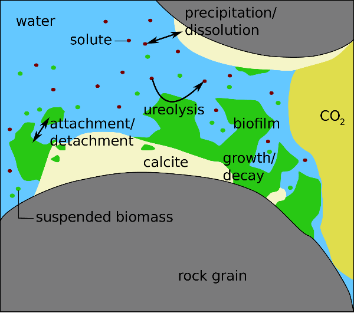

# Biomineralization

Microbially induced calcite precipitation (MICP) is a biomeineralization technology.
It can be used in the context of sealing possible leakage pathways of subsurface gas or oil reservoirs as well as other applications.
The necessary processes are two-phase multi-component reactive transport including precipitation and dissolution
of calcite as well as the biomass-related processes: attachment of biomass to surfaces,
detachment of biomass from a biofilm, and growth and decay of biomass.
Additionally, the reduction in porosity and permeability has to be considered;
this results from the presence of the solid phases biofilm and calcite in the pore space.

MICP offers an engineering option that
uses controlled biofilm growth to achieve targeted
calcite precipitation. In subsurface applications, this process is typically
associated with a reduction of porosity and, even more importantly, of permeability.
As an engineering technology, it can be used to alter hydraulic flow conditions
and can be applied, for example, to cut off highly permeable pathways such as
fractures, faults, or behind-casing defects in boreholes within a geological
formation, e.g. [@Phillips2013a].

The bacterium used, S.~pasteurii,
expresses the enzyme urease that catalyzes the hydrolysis reaction of
urea (CO(NH<sub>2</sub>)<sub>2</sub>) into ammonia (NH<sub>3</sub>) and carbon
dioxide (CO<sub>2</sub>):

```math
\mathrm{CO(NH_2)_2} + 2\mathrm{H_2O} \xrightarrow{urease}%\longrightarrow
2\mathrm{NH_{3}} + \mathrm{H_2CO_{3}}.
```

Aqueous solutions of ammonia become alkaline until the equilibrium of ammonium and ammonia is reached.
Thus, the ureolysis reaction leads to an increase in pH until the pH is equal to the pKa of ammonia:
This shifts the
carbonate balance in an aqueous solution toward higher concentrations of
dissolved carbonate.
Adding calcium to the system then results
in the precipitation of calcium carbonate:

```math
CO_{3}^{2-} + Ca^{2+} -> CaCO_3 \downarrow}.
```

The resulting overall MICP reaction equation is:
```math
\mathrm{CO(NH_2)_2} + 2\mathrm{H_2O} + \mathrm{Ca^{2+}} \xrightarrow{urease}%\longrightarrow
2\mathrm{NH_{4}^{+}} + \mathrm{CaCO_{3}} \downarrow.
\label{eq:MICP_chem_reaction}
```

In a porous medium, this process,
which results in the aforementioned impacts on the hydraulic properties,
depends on the interplay between biofilm growth, fluid dynamics,
and reaction rates.
A pore-scale sketch of the most important processes of MICP is shown
in the Figure.





A major difficulty for practical engineering applications of
MICP is the predictive planning of its use and impact,
since it involves a number of complex interacting processes.
While the basic chemistry and the flow processes are known, it is the exact
quantitative description of the interactions and, in particular, the influence
of the biofilm and the developing precipitates
that pose challenges to achieving predictability.


However, for the sake of simplicity, the dissociation processes are not modeled in this example and it
is assumed that the system has reached a steady state were the calcite precipitation rate is equal to the rate of ureolysis.

# Model Concept
The conceptual model for biomineralization follows the one presented by [@Ebigbo2012] and [@Hommel2015].
It accounts for two-phase multi-component reactive transport on the continuum scale, including biofilm and calcite as solid phases.
The reactions considered are pH-dependent dissociation reactions, microbial growth, and decay as well as microbially catalyzed ureolysis and mass-transfer reactions between the different phases.
A mass transfer may occur between both fluid phases by the mutual dissolution of
water and CO<sub>2</sub> in the gas or the aqueous phase. It may also occur between
the aqueous phase and the two *solid* phases,
biofilm and calcite denoted by subscripts (f) and (c) respectively, by attachment or
detachment of biomass and precipitation or dissolution of calcite.

The mobile components, denoted by superscripts k, are water (w),
dissolved inorganic carbon ($$\mathrm{C<sub>tot</sub>}$$),
sodium (Na), chloride (Cl), calcium (Ca), urea (u),
substrate (s), oxygen (O<sub>2</sub>), and suspended biomass (b).
A substrate is the carbon and energy source of the bacteria
and O<sub>2</sub> is the electron acceptor.


The primary variables solved are the aqueous-phase pressure $`p_\mathrm{w}`$,
mole fractions $` \textbf v `$ $`x^\kappa_\mathrm{w}``$ of component k in the water phase, and
for the solid phases biofilm and calcite, volume fractions $`\phi_\lambda `$ .
However, the CO<sub>2</sub>-phase saturation is used as the primary variable instead of the mole fraction of total inorganic carbon in water $`x^\mathrm{C_{tot}}_\mathrm{w}$$
whenever both fluid phases are present within the same control volume [@Class2002].
All reactive and mass-transfer processes are incorporated in the mass balance equations for the components
by component-specific source and sink terms:

```math
\sum\limits_{\alpha} \left[\frac{\partial}{\partial t}\left(\phi \rho_\mathrm{\alpha,\,mol} x^\kappa_\alpha S_\alpha \right) + \nabla\cdotp \left(\rho_\mathrm{\alpha,\,mol} x^\kappa_\alpha \mathbf{v}_\alpha \right) - \nabla\cdotp \left(\rho_\mathrm{\alpha,\,mol} \mathbf{D}^\kappa_\mathrm{pm,\alpha} \nabla x^\kappa_\alpha \right) \right] = q^\kappa,\:\alpha\in \mathrm{\{n;w\}} .
\tag{1}
```

Here, $`t`$ is time, $`\phi`$ porosity, $`\rho_\mathrm{\alpha,\,mol}`$, $`S_\alpha`$,
and $`\mathbf{v}_\alpha`$ the molar density, saturation and the velocity of phase $`\alpha`$ respectively,
$$x^\kappa_\alpha`$ the mole fraction of component k in phase $`\alpha `$ .
$$\mathbf{D}_\mathrm{pm,\alpha}`$ is the dispersion tensor of phase $`\alpha`$ in the porous medium,and $`q^\kappa`$ is the source term of component k due to biochemical reactions. However, all components except water, CO<sub>2</sub> , and O<sub>2</sub> are assumed to be restricted to the water phase.

The mass balances for the solid phases calcite and biofilm contain
only a storage and source term since they are immobile:

```math
\frac{\partial}{\partial t} \left(\phi_\lambda \rho_\lambda \right) = q^\lambda,\:\lambda\in \mathrm{\{c;f\}}.
\tag{2}
```

Here, $`\phi_\lambda`$ and $`\rho_\lambda`$ are volume fraction and mass density of
the solid phase $`\lambda`$, and $`q^\lambda`$ is the source term of phase $`\lambda`$ due to biochemical reactions.
The sources and sinks due to reactions $`q^\kappa$ and $q^\lambda`$ are specific to the components and are discussed in details in the subsequent section.

## Component-specific reactive source and sink terms

The source and sink terms account for the biogeochemical reactions occurring during MICP and the presence of CO<sub>2</sub>:
ureolysis, calcite precipitation, and dissolution, biomass growth under consumption of oxygen and substrate, biomass decay, as well as attachment and detachment of biomass.

## Water, sodium and chloride
Sodium and chloride do not participate in the reactions and water is the solute and is abundant, which is why its consumption by the hydrolysis of urea (Eq. [3](#mjx-eqn-eq:q_w_na_cl)) is considered negligible.
Thus, the reactive source terms for water $`q^\mathrm{w}`$, sodium $`q^\mathrm{Na}`$ and chloride $`q^\mathrm{Cl}`$ are zero:

```math
q^\mathrm{w} =   q^\mathrm{Na} = q^\mathrm{Cl} = 0
tag{3}
```

## Urea and total nitrogen
The source term for $`\mathrm{N_{tot}}`$, $`q^\mathrm{N_{tot}}`$, and the sink term for urea $`q^\mathrm{u}`$ result from ureolysis (Eq. [5](#mjx-eqn-eq:q_ntot)).
For each mole of urea hydrolyzed, 2 moles of $`\mathrm{N_{tot}}`$ are generated. The $`q^\kappa`$ are thus:

```math
q^\mathrm{u}=-r_\mathrm{urea},
\tag{4}
```

```math
q^\mathrm{N_{tot}}=2r_\mathrm{urea},
\tag{5}
```

where $`r_\mathrm{urea}`$ is the ureolysis rate calculated according to [@Lauchnor2015],
who investigated the influences of urea,
NH<sup>4+</sup>, cell concentration, and pH of the medium on the ureolysis of whole cells of $`\textit{S.~pasteurii} $`:

```math
r_\mathrm{urea} = k_\mathrm{urease}
\:k_\mathrm{ub}\:\rho_\mathrm{f}\:\phi_\mathrm{f}
\:\frac{m^\mathrm{u}}{m^\mathrm{u}+K_\mathrm{u}}.
```

$`r_\mathrm{urea}`$ represents the revised rate of ureolysis according to [@Lauchnor2015],
$`k_\mathrm{urease}`$ the revised maximum activity of urease adapted from  [@Lauchnor2015],
$`\rho_\mathrm{f}`$ and $`\phi_\mathrm{f}`$ the density and volume fraction of biofilm respectively,
$`k_\mathrm{ub}`$ the mass ratio of urease to biofilm,
$`m^\mathrm{u}`$ the molality of urea calculated from the water phase composition,
and $`K_\mathrm{u}`$ is the half saturation constant for urea adapted from [@Lauchnor2015].

## Calcium and calcite
The source terms of calcium $`q^\mathrm{Ca}`$ and calcite $`q^\mathrm{c}`$
are determined by the rates of precipitation and dissolution.
When the aqueous phase is oversaturated with respect to calcite, it precipitates.
In the opposite case, calcite dissolves until the solution is saturated or all calcite is already dissolved:

```math
q^\mathrm{Ca} = r_\mathrm{diss} - r_\mathrm{prec},
```
```math
q^\mathrm{c} = - r_\mathrm{diss} + r_\mathrm{prec}.
```

Here, $`r_\mathrm{diss}`$ is the rate of calcite dissolution and $`r_\mathrm{prec}`$ the rate of calcite precipitation.
Both reaction rates are calculated as follows, depending on the interfacial area available for the reaction
as well as the saturation index $`\Omega`$ and, in the case of the dissolution, additionally on the molality of H<sup>+</sup>.
The precipitation rate of calcite is calculated as:

```math
r_\mathrm{prec} = k_\mathrm{prec}A_\mathrm{sw}\left(\Omega-1\right)^{n_\mathrm{prec}};\:\text{for}\: \Omega\ge1,
```
```math
A_\mathrm{sw} = A_\mathrm{sw,0}\left( 1-\frac{\phi_\mathrm{c}}{\phi_0} \right)^\frac{2}{3},
```
```math
\Omega = \frac{m^\mathrm{Ca^{2+}}\gamma^\mathrm{Ca^{2+}} m^\mathrm{CO_3^{2-}}\gamma^\mathrm{CO_3^{2-}}}{K_\mathrm{sp}},
```

where $`k_\mathrm{prec}`$ and $`n_\mathrm{prec}`$ are empirical precipitation parameters,
$`A_\mathrm{sw}`$ and $`A_\mathrm{sw,0}`$ are the current and initial interfacial areas respectively
between the water phase and the solid phases,
$`K_\mathrm{sp}`$ the calcite solubility product and
$`m^\mathrm{Ca^{2+}}`$ and $`m^\mathrm{CO_3^{2-}}`$ the molalities of calcium and carbonate respectively.
The activity coefficients $`\gamma^\kappa`$ are calculated using
Pitzer equations.
The dissolution rate of calcite is calculated as:

```math
r_\mathrm{diss} = \left(k_\mathrm{diss,1}m^\mathrm{H^{+}}+
k_\mathrm{diss,2}\right)A_\mathrm{cw}\left(\Omega-1\right)^{n_\mathrm{diss}};\:\text{for}\: \Omega<1,
```
```math
A_\mathrm{cw} = \mathrm{min} \left(A_\mathrm{sw}, a_\mathrm{c}\phi_\mathrm{c}\right),
```

where $`k_\mathrm{diss,1}`$, $`k_\mathrm{diss,2}`$, and $`n_\mathrm{diss}`$ are dissolution parameters [@Chou1989, Compton1989]
and $`a_\mathrm{c}`$ is the specific surface area and $`\phi_\mathrm{c}`$ the volume fraction of calcite.

However, in the present simplified chemistry system, dissolution is neglected, $`r_\mathrm{diss}=0`$,
and instead of calculating the complex geochemistry, e.g. dissociation of inorganic carbon into carbonate and bicarbonate,
it is assumed that the system has reached a steady state, were precipitation rate is equal to the ureolysis rate and thus it results:

```math
r_\mathrm{prec} = r_\mathrm{urea}
```

## Dissolved inorganic carbon}\label{sec:source_ctot}
Dissolved inorganic carbon is generated by the hydrolysis of urea
as well as by the dissolution of calcite while it is consumed by the precipitation of calcite.
Thus, the source term of dissolved inorganic carbon $`q^\mathrm{C_{tot}}`$ results in:

```math
q^\mathrm{C_{tot}} =  r_\mathrm{urea} + r_\mathrm{diss} - r_\mathrm{prec},
```


## Suspended and attached biomass

The source and sink terms of suspended and attached biomass (biofilm), $`q^\mathrm{b}`$ and $`q^\mathrm{f}`$,
include four reaction rates each, corresponding to the biomass-related processes the model accounts for.
These processes are growth and decay increasing and decreasing the suspended or attached biomass as well as
attachment and detachment describing the transfer of biomass from the suspended to the attached state and vice versa:

```math
q^\mathrm{b} = \frac{r^\mathrm{b}_\mathrm{g} - r^\mathrm{b}_\mathrm{b} - r_\mathrm{a} + r_\mathrm{d}}{M^\mathrm{b}},
```

```math
q^\mathrm{f} = \frac{r^\mathrm{f}_\mathrm{g} - r^\mathrm{f}_\mathrm{b} + r_\mathrm{a} - r_\mathrm{d}}{M^\mathrm{f}}
```

where $`r^\mathrm{b}_\mathrm{g}`$ is the growth rate and $`r^\mathrm{b}_\mathrm{b}`$ the decay rate of suspended biomass,
$`r_\mathrm{a}`$ the attachment rate, $`r_\mathrm{d}`$ the detachment rate and
$`M^\mathrm{b}`$ the molar mass of biomass to convert the rates in the units
from mass to moles per volume and time.
Accordingly, $`r^\mathrm{f}_\mathrm{g}`$ and $`r^\mathrm{f}_\mathrm{b}`$ are the growth and decay of biofilm
and $`M^\mathrm{f}`$ is the molar mass of biofilm.
All rates influencing both attached and suspended biomass are assumed to be of a first-order type, where
the rate is calculated by the product of a specific rate and the respective biomass, which is
$`C_\mathrm{w}^\mathrm{b}S_\mathrm{w}\phi`$ in the case of suspended and
$`\phi_\mathrm{f}\rho_\mathrm{f}`$ in the case of attached biomass.
Here, $`C_\mathrm{w}^\mathrm{b}`$ is the suspended biomass mass concentration in the water phase,
$`S_\mathrm{w}`$ the water phase saturation.

The growth rates of suspended and attached biomass are as follows:

```math
r_\mathrm{g}^\mathrm{b} = \mu_\mathrm{g} C_\mathrm{w}^\mathrm{b}S_\mathrm{w}\phi,
```
```math
  r_\mathrm{g}^\mathrm{f} = \mu_\mathrm{g} \phi_\mathrm{f}\rho_\mathrm{f},
```
with the specific growth rate $`\mu_\mathrm{g}$.
`$\mu_\mathrm{g}`$ is calculated using double Monod kinetics to reproduce the dependency of
the microbial growth on both substrate and oxygen.

```math
 \mu_\mathrm{g} = k_\mathrm{\mu} Y
 \frac{C_\mathrm{w}^\mathrm{s}}{K_\mathrm{s} + C_\mathrm{w}^\mathrm{s}}
 \frac{C_\mathrm{w}^\mathrm{O_2}}{K_\mathrm{O_2} + C_\mathrm{w}^\mathrm{O_2}}.
```

Here, $`k_\mathrm{\mu}`$ is the maximum specific growth rate, according to [@Connolly2014],
`$Y`$ the yield coefficient expressing the ratio of biomass generated to the mass of substrate consumed.
`$C_\mathrm{w}^\mathrm{s}`$ and $`C_\mathrm{w}^\mathrm{O_2}`$
are the mass concentrations of substrate and oxygen in the water phase and
`$K_\mathrm{s}`$ and  $`K_\mathrm{O_2}`$
are the half-saturation coefficients for substrate and oxygen respectively.

The decay rates are calculated similarly to the growth rates:

```math
r_\mathrm{b}^\mathrm{b} = k_\mathrm{b}^\mathrm{b} C_\mathrm{w}^\mathrm{b}S_\mathrm{w}\phi,
```

```math
 r_\mathrm{b}^\mathrm{f} =  k_\mathrm{b}^\mathrm{f}\phi_\mathrm{f}\rho_\mathrm{f},
```

except that the specific decay rates of suspended and attached biomass,
$`k_\mathrm{b}^\mathrm{b}`$ and $`k_\mathrm{b}^\mathrm{f}`$ respectively,
take different processes into account, increasing inactivation.
For suspended biomass, non-optimal, acidic pH is assumed to increase inactivation:

```math
k_\mathrm{b}^\mathrm{b} = b_0 \left(1 + \frac{K_\mathrm{pH}}{m_\mathrm{H^{+}} ^2} \right),
```

where $`b_0`$ is the endogenous decay rate
and $`K_\mathrm{pH}`$ accounts for increased cell inactivation at low pH.
High pH is assumed not to influence the inactivation of suspended biomass, as S. pasteurii is alkaliphile.
On the contrary, attached cells are protected from harsh environmental conditions and the presence of CO<sub>2</sub> within the biofilm
by protective mechanisms such as extracellular polymers [@Mitchell2008].
However, as calcite precipitates mainly in or close to the biofilm, cells may be covered with calcite precipitates
or disrupted by crystals inactivating the affected cells [@Dupraz2009a, Whiffin2007].
Consequently, the precipitation rate is assumed to increase the specific decay rate of attached biomass:

```math
 k_\mathrm{b}^\mathrm{f} = b_0 + \frac{r_\mathrm{prec} M^\mathrm{c}}{\rho_\mathrm{c}\left(\phi_0 - \phi_\mathrm{c}\right)},
```

where $`\frac{r_\mathrm{prec} M^\mathrm{c}}{\rho_\mathrm{c}}`$ is the volumetric calcite precipitation rate,
$`M^\mathrm{c}`$ being the molar mass and $`\rho_\mathrm{c}`$ the density of calcite, and
$`\phi_0 - \phi_\mathrm{c}`$ is the space available for calcite precipitation, which may occur in the biofilm or the pore space.

The attachment rate $`r_\mathrm{a}`$ quantifies the biomass transfer from
the suspended to the attached state.
As attachment is modeled assuming a first-order kinetic rather than a
sorption-type behavior, it is independent of the amount of attached biomass:

```math
r_\mathrm{a}= k_\mathrm{a} C^\mathrm{b}_\mathrm{w} \phi S_\mathrm{w},
```

where $`k_\mathrm{a}`$ is the specific attachment rate.
It is considered to
consist of two terms, $`c_\mathrm{a,1}\phi_\mathrm{f}`$ and $`c_\mathrm{a,2}$,
whose coefficient $`c_\mathrm{a,1}`$ accounts for preferential attachment to existing biofilm
while $`c_\mathrm{a,2}`$ accounts for the unspecific attachment to arbitrary surfaces:

```math
k_\mathrm{a}=c_\mathrm{a,1} \phi_\mathrm{f} + c_\mathrm{a,2}.
```

Detachment of biomass from biofilm is assumed to be proportional to the shear stress.
Additionally, the growth contributes to the detachment rate, as vigorously growing
biofilm is typically weaker and as such more susceptible to detachment.
As the model of [@Ebigbo2012] is defined on the Darcy scale but the shear stress is a micro-scale property,
it is approximated using the absolute value of the water-phase potential gradient:

```math
r_\mathrm{d}=k_\mathrm{d} \phi_\mathrm{f} \rho_\mathrm{f},

```

where $`r_\mathrm{d}`$ is the rate of detachment and $`k_\mathrm{d}`$ the detachment coefficient:

```math
k_\mathrm{d}=c_\mathrm{d}
\left( \phi S_\mathrm{w} \left|\nabla p_\mathrm{w} -  \rho_\mathrm{w} \mathbf{g} \right| \right)^{0.58}
+ \frac{\phi_\mathrm{f}}{\phi_0-\phi_\mathrm{c}} \mu_\mathrm{g}.
```

Here, $`c_\mathrm{d}`$ is a coefficient for the shear-stress-dependent detachment,
$`\left|\nabla p_\mathrm{w} -  \rho_\mathrm{w} \mathbf{g} \right|`$ the absolute value of
the water-phase potential gradient, and $`\phi_0`$ the initial porosity.


## Substrate and oxygen
The consumption of substrate and oxygen is linked to the growth of both suspended and attached biomass
by the yield coefficient $`Y`$ of substrate:

```math
q^\mathrm{s} = - \frac{r^\mathrm{b}_\mathrm{g} + r^\mathrm{f}_\mathrm{g}}{M^\mathrm{s}Y}.

```

In the case of oxygen, the coefficient $`F`$, which is the ration of oxygen consumed per substrate consumed,
is used to express the biomass yield per oxygen consumed using $`Y`$:

```math
 q^\mathrm{O_2} = F q^\mathrm{s} = - F \frac{ r^\mathrm{b}_\mathrm{g} + r^\mathrm{f}_\mathrm{g}} {M^\mathrm{O_2}Y}.
```

## Supplementary equations
\subsubsection{Permeability and porosity}\label{sec:perm_poro_pw}
The permeability decreases due to biofilm growth and calcite precipitation.
In the model, the reduction of permeability is calculated based on the
reduction of porosity using a Kozenzy-Carman-type relationship:

```math
\frac{K}{K_\mathrm{0}}=\left(\frac{\phi}{\phi_\mathrm{0}}\right)^3 \left(\frac{1-\phi_0}{1-\phi}\right)^2.
```

Here, $`K_\mathrm{0}`$ is the initial permeability,
and $`\phi_0`$ is the initial porosity. The porosity $`\phi`$ decreases as
the volume fractions of biofilm and calcite increase:

```math
\phi=\phi_\mathrm{0}-\phi_\mathrm{c}-\phi_\mathrm{f}.
```


## Fluid properties
The density and the viscosity of the CO<sub>2</sub> phase are calculated using
the relation given by [@Span1996] and [@Fenghour1998] respectively.
In these calculations, the effects of the small amounts of water and oxygen are neglected.
The density and the viscosity of the aqueous phase are calculated
according to [@Batzle1992] as a function of salinity.
Sodium, chloride and calcium are considered to contribute to the salinity.


## Phase partitioning of components
The dissolution of CO<sub>2</sub> in the aqueous phase is calculated according
to [@Duan2003] as a function of temperature, pressure and salinity.
In the two-phase case, the concentration of carbonic acid is assumed to be
equal to the solubility while, in the case of the exclusive presence of the aqueous phase,
the concentration of inorganic carbon
is exclusively dependent on the precipitation, dissolution and ureolysis reactions.
In this case, the solubility represents the maximum possible concentration.
For the solubility of oxygen in the aqueous phase, Henry's law is used.


In the following, we take a close look at the files containing the set-up: At first, boundary conditions
and spatially distributed parameters are set in `problem.hh` and `spatialparams.hh`, respectively.
The CO<sub>2</sub> properties are stored in the CO<sub>2</sub> tables in the subfolder `material` (`co2tableslaboratory.hh`,`co2valueslaboratory.inc`).
Material also contains a specialized fluid- and solidsystem (`fluidsystems/biominsimplechemistry.hh`,`biominsolids.hh`)
as well as the chemical reactions (`chemistry/biocarbonicacidsimplechemistry.hh`)
and some additional components in the subfolder `components`.

A special feature of this example, which might be interesting also for non-biomineralization modelers,
is that it uses the CheckPointTimeLoop extensively to set the injections of the various consecutive biomineralization solution injections based on a seperate input file `injections.dat`.
Using this file, in the `problem.hh`, it is also determined which type of solution is currently injected (the injectionType_).


[@Batzle1992]: https://library.seg.org/doi/10.1190/1.1443207  "Seismic Properties of Pore Fluids"
[@Class2002]: https://www.sciencedirect.com/science/article/pii/S0309170802000155 "Numerical simulation of non-isothermal multiphase multicomponent processes in porous media. 2. Applications for the injection of steam and air"
[@Connolly2014]: http://www.ncbi.nlm.nih.gov/pubmed/23835134 "Construction of two ureolytic model organisms for the study of microbially induced calcium carbonate precipitation"
[@Duan2003]: https://www.sciencedirect.com/science/article/pii/S0009254102002632 "An improved model calculating CO<sub>2</sub> solubility in pure water and aqueous NaCl solutions from 273 to 533 K and from 0 to 2000 bar"
[@Dupraz2009a]: http://linkinghub.elsevier.com/retrieve/pii/S0009254109002265 "Experimental and numerical modeling of bacterially induced pH increase and calcite precipitation in saline aquifers"
[@Ebigbo2012]: https://agupubs.onlinelibrary.wiley.com/doi/full/10.1029/2011WR011714 "Darcy-scale modeling of microbially induced carbonate mineral precipitation in sand columns"
[@Fenghour1998]: https://aip.scitation.org/doi/10.1063/1.556013 "The Viscosity of Carbon Dioxide"
[@Hommel2015]: https://agupubs.onlinelibrary.wiley.com/doi/full/10.1002/2014WR016503 "A revised model for microbially induced calcite precipitation: Improvements	and new insights based on recent experiments"
[@Lauchnor2015]: http://dx.doi.org/10.1111/jam.12804 "Whole cell kinetics of ureolysis by Sporosarcina pasteurii"
[@Mitchell2008]: https://www.sciencedirect.com/science/article/pii/S0896844608002040 "Resilience of planktonic and biofilm cultures to supercritical CO<sub>2</sub>"
[@Span1996]: https://aip.scitation.org/doi/abs/10.1063/1.555991 "A new equation of state for carbon dioxide covering the fluid region from the triple-point temperature to 1100 K at pressures up to 800 MPa"